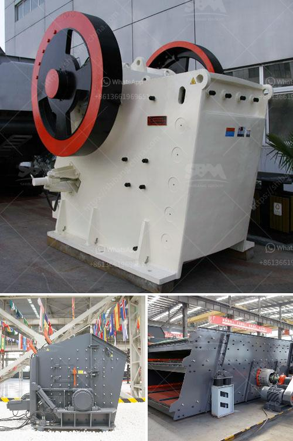

<h3>jaw crusher philippines 50 tons per day</h3>
The jaw crusher has been a staple of the mining industry for many years. It is often utilized in primary crushing operations to break large rocks into smaller pieces, and it is also used in the construction of roads, railway tracks, and various other infrastructure projects.

In the Philippines, the jaw crusher is widely used in the mining industry due to its simple structure, reliable performance, and easy maintenance. It is primarily designed for high-efficiency coarse and medium crushing of hard and abrasive materials, such as granite, basalt, and limestone.

One of the key advantages of a jaw crusher is its ability to process hard materials with high efficiency, reducing time and energy consumption for the crushing process. In addition, the jaw crusher can produce narrow particle size distribution, thus minimizing the need for secondary crushing. This not only saves money but also reduces the environmental impact of mining operations.

The Philippines has a growing demand for infrastructure projects, such as roads, bridges, and buildings, which in turn drives the need for high-quality aggregates. With a jaw crusher that can process 50 tons of material per day, it provides an important solution to meet the increasing demand for aggregates in the country.

Moreover, the jaw crusher is user-friendly and easy to operate, making it an ideal choice for small and medium-sized quarry operators who require efficient crushing solutions. The compact size and maneuverability of the jaw crusher also make it suitable for onsite crushing in remote locations, contributing to cost savings and increased productivity.

In conclusion, the jaw crusher Philippines 50 tons per day is a reliable, versatile, and efficient crushing machine that offers superior crushing performance, low maintenance costs, and a long lifespan. It can process various materials such as granite, basalt, limestone, and river pebbles, and produce narrow particle size distributions, creating value for construction, mining, and infrastructure projects in the Philippines.
<h3>Contact us</h3><ul><li><strong>Whatsapp:&nbsp;<a href="https://wa.me/8613661969651">+8613661969651</a></strong></li><li><a href="https://swt.shibang-china.com/?git&amp;zhl&amp;jaw crusher philippines 50 tons per day"><strong>Online Service(chat now)</strong></a></li></ul><h3>Related</h3><ul><li><a href='artificial sand project.md'>artificial sand project</a></li><li><a href='m sand machine in tamil nadu.md'>m sand machine in tamil nadu</a></li><li><a href='used vibro screener for sale.md'>used vibro screener for sale</a></li><li><a href='clay making process nigeria.md'>clay making process nigeria</a></li><li><a href='small scale mobile sand and stone crushers.md'>small scale mobile sand and stone crushers</a></li></ul>