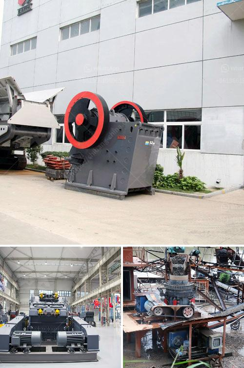

<h3>jaw crusher price 200mm</h3>
The jaw crusher is a widely used crushing equipment utilized in industries such as mining, building materials, and infrastructure projects due to its low cost and reliable performance. It is mainly used as a primary crusher for coarse crushing or a secondary crusher for medium and fine crushing.

When it comes to jaw crusher prices, various factors need to be considered to determine its value. One such factor is the maximum input size. In this case, a jaw crusher with a maximum input size of 200mm would be appropriate. This specification allows the machine to handle larger rocks or ores without causing any damage to the crusher components.

Another important factor is the output size range required by the customer. If the customer demands a finer output size, a secondary or tertiary crusher may be necessary after the jaw crusher. However, for most purposes, a jaw crusher with a 200mm input size can provide satisfactory results.

The price of a jaw crusher with a 200mm input size varies depending on factors such as the design, quality, capacity, and specifications of the machine. Suppliers often offer customized solutions tailored to the customer's specific needs, which can affect the final price.

In general, jaw crushers with a 200mm input size range from $15,000 to $30,000. Prices may vary even further depending on the aforementioned factors. It is crucial for buyers to communicate their requirements and budget with suppliers to receive the most cost-effective solution.

In conclusion, the jaw crusher with a 200mm input size offers a cost-efficient solution for various crushing applications. Its price depends on factors such as the design, quality, capacity, and specifications. Buyers should communicate their specific needs and budget to suppliers to find the most suitable and affordable option.
<h3>Contact us</h3><ul><li><strong>Whatsapp:&nbsp;<a href="https://wa.me/8613661969651">+8613661969651</a></strong></li><li><a href="https://swt.shibang-china.com/?git&amp;zhl&amp;jaw crusher price 200mm"><strong>Online Service(chat now)</strong></a></li></ul><h3>Related</h3><ul><li><a href='bauxite ore business plan pdf.md'>bauxite ore business plan pdf</a></li><li><a href='quartz manufacturing process.md'>quartz manufacturing process</a></li><li><a href='quote for hydraulic cone crusher.md'>quote for hydraulic cone crusher</a></li><li><a href='quarry screening equipment.md'>quarry screening equipment</a></li><li><a href='grinding mill power.md'>grinding mill power</a></li></ul>