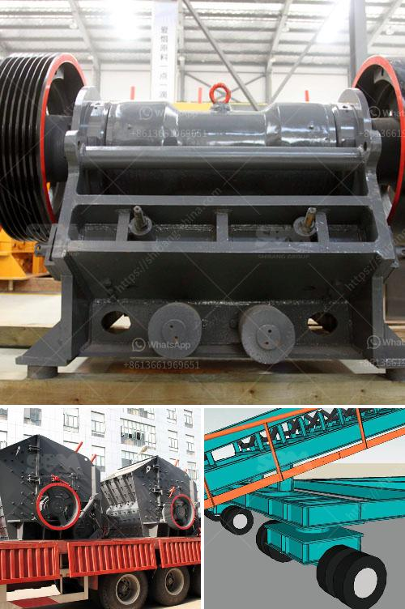

<h3>jaw crusher project report pdf</h3>
A jaw crusher is the most commonly used primary crusher. It uses simple technology to break down large blocks into smaller pieces. Their simplicity requires little engineering expertise to operate. A jaw crusher is reliable and needs less maintenance than other types of crushers. A jaw crusher has one fixed and one moving surface in a V-shaped configuration. The moving “jaw” is mounted on an eccentric shaft. The reciprocal motion of this jaw presses the material against the fixed jaw.

Rotational movement is achieved via a motor and a belt. The space between the jaws narrows as the material moves downward. Once crushed to this smaller size, the material is sent to a secondary jaw crusher. The process repeats itself until the material reaches the desired size. This jaw crusher project report pdf consists of full details on the jaw crusher project.

The jaw crusher project report pdf is valued at USD XX million in 2022 and is projected to reach USD XX million by the end of 2026, growing at a CAGR of XX% during the forecast period. The report covers the product positioning and market positioning of key players specific to the jaw crusher market. It provides a thorough analysis of these key players in terms of their financials, market share, product portfolio, and growth strategies.

The report also includes the analysis of various drivers and restraints, along with opportunities, challenges, and key developments in the jaw crusher market. This analysis helps in understanding the dynamic market trends, competitor strategies, and business prospects. The jaw crusher project report pdf includes detailed information about the market segmentation based on the product type, geographic regions, and key players.

The global jaw crusher market is segmented based on different product types, including double-toggle jaw crusher, single-toggle jaw crusher, and others. The double-toggle jaw crusher segment is expected to witness significant growth during the forecast period. The single-toggle jaw crusher segment is expected to account for the largest market share during the forecast period.

The jaw crusher market is segmented into North America, Europe, Asia Pacific, Latin America, and the Middle East and Africa. Asia Pacific dominated the global jaw crusher market and is expected to witness the highest CAGR during the forecast period. This can be attributed to the increasing demand for construction and infrastructure development in emerging economies such as China and India.

The key players in the jaw crusher market include Terex Corporation, Sandvik AB, Metso Corporation, ThyssenKrupp, Lippmann-Milwaukee, and McCloskey International, among others. These players are focusing on various growth strategies such as partnerships, collaborations, mergers and acquisitions, and product launches to strengthen their market position.

To sum up, the jaw crusher project report pdf provides a thorough analysis of the market, including market size, growth prospects, market trends, challenges, and opportunities. It also includes profiles of key players operating in the market, along with their financials, market share, product portfolio, and growth strategies. The report is a valuable source of information for stakeholders, investors, and new entrants in the jaw crusher market.
<h3>Contact us</h3><ul><li><strong>Whatsapp:&nbsp;<a href="https://wa.me/8613661969651">+8613661969651</a></strong></li><li><a href="https://swt.shibang-china.com/?git&amp;zhl&amp;jaw crusher project report pdf"><strong>Online Service(chat now)</strong></a></li></ul><h3>Related</h3><ul><li><a href='cost of 1000 tpd cement plant.md'>cost of 1000 tpd cement plant</a></li><li><a href='jaw crushers impact.md'>jaw crushers impact</a></li><li><a href='gypsum stone crusher machine.md'>gypsum stone crusher machine</a></li><li><a href='calcium silicone crushers.md'>calcium silicone crushers</a></li><li><a href='mining mining processing.md'>mining mining processing</a></li></ul>