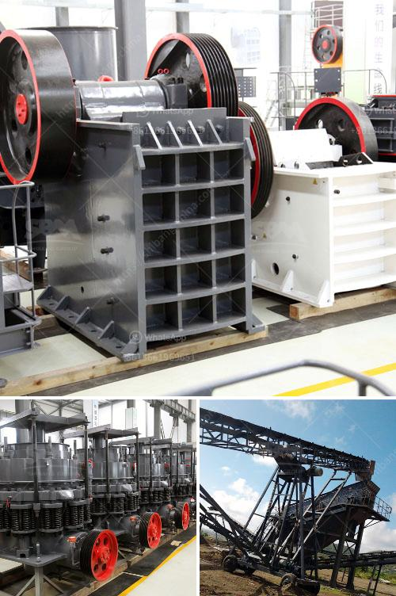

<h3>jaw crusher specification</h3>
Jaw crushers are used in various industries, including mining and construction. They are used primarily to crush rock and ore, making it easier for transportation and subsequent processing. The jaw crusher specification is one of the key factors in determining the performance of the crusher.

The most essential parameters that define the concasseur a machoir specifications are the feed opening size, maximum feed size, and processing capacity. The feed opening size is the dimension of the jaw crusher from the top of the fixed jaw plate to the top of the movable jaw plate. It determines the maximum size of the material that can be fed into the crusher.

The maximum feed size refers to the largest size of the material that the crusher can handle. It is important to ensure that the feed size does not exceed the specified limit, as this can cause damage to the crusher.

The processing capacity of the jaw crusher specifies the maximum amount of material that the crusher can process within a specific time frame. It is usually measured in tons per hour and determines the efficiency and productivity of the crusher.

Other important specifications include the discharge opening size, which determines the size of the crushed product, and the eccentric shaft speed, which affects the crushing and screening process.

When selecting a jaw crusher, it is crucial to consider the specific requirements of the application and the desired output. Depending on the nature of the material and the production goals, different specifications may be more suitable.

In conclusion, understanding the jaw crusher specifications is crucial for selecting the right crusher for a particular application. The feed opening size, maximum feed size, processing capacity, discharge opening size, and eccentric shaft speed are important factors to consider. By choosing the appropriate specifications, one can ensure optimal crusher performance and efficient crushing processes.
<h3>Contact us</h3><ul><li><strong>Whatsapp:&nbsp;<a href="https://wa.me/8613661969651">+8613661969651</a></strong></li><li><a href="https://swt.shibang-china.com/?git&amp;zhl&amp;jaw crusher specification"><strong>Online Service(chat now)</strong></a></li></ul><h3>Related</h3><ul><li><a href='processing plan for feldspar ore.md'>processing plan for feldspar ore</a></li><li><a href='washing process of chromite ore beneficiation.md'>washing process of chromite ore beneficiation</a></li><li><a href='stone crushing equipment available in northern cape.md'>stone crushing equipment available in northern cape</a></li><li><a href='mobile and modular coal washing plants.md'>mobile and modular coal washing plants</a></li><li><a href='roller mill manufacturers in nigeria.md'>roller mill manufacturers in nigeria</a></li></ul>