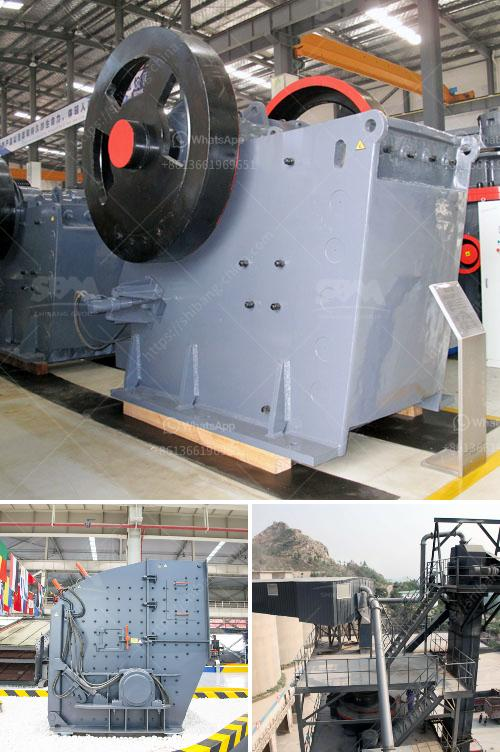

<h3>jaw crusher specifications</h3>
A jaw crusher is a versatile equipment that is commonly used in mining, construction, and demolition industries. Jaw crushers are designed to crush material between two plates or jaws. One jaw is stationary, while the other is moving. This movable jaw exerts force on the rock by pressing it against the stationary plate.

In the mining industry, jaw crushers are used to crush large rocks into smaller pieces in order to transport them easily. This process is commonly used in rock quarries, concrete recycling, and demolition projects. Jaw crushers have a variety of specifications that depend on the machine's capacity, feed size, and horsepower.

Here, we'll delve into the jaw crusher specifications to understand its components such as units, jaw sizes, and feed capacity.

Jaw crushers are available in two different types: single-toggle and double-toggle units. Single-toggle jaw crushers have one fixed plate, while the other plate pivots about the top hinge. The double-toggle jaw crushers have two pivoting plates.

Jaw crushers come in different sizes and specifications. The size of the jaw crusher determines the maximum size of feed material it can accept. Larger jaw crushers can generally handle harder materials with maximum feed sizes ranging from 600-1200mm, whereas smaller jaw crushers may be limited to 300-600mm or less, depending on the crusher model and manufacturer.

The jaw crusher's feed capacity specifies the maximum size of the material that can be fed into the jaw crusher chamber. It is usually expressed in cubic meters per hour or tons per hour. The capacity is primarily determined by the crusher's size, the type of material to be crushed, and the required product size.

The jaw crusher's horsepower is a measure of the machine's ability to generate power to crush the material effectively. Higher horsepower indicates a more powerful and productive machine that can process larger volumes of material efficiently.

Apart from the main specifications discussed above, there are additional parameters to consider. These include the operational speed of the jaw crusher, which determines the rate at which the material is crushed, and the discharge opening size, which controls the product size.

Furthermore, it is essential to review the manufacturer's maintenance guidelines to ensure the proper functioning and longevity of the jaw crusher. Regular maintenance, including lubrication, inspections, and part replacements, enhances the crusher's performance and reduces downtime.

To conclude, jaw crusher specifications play a crucial role in determining the overall performance and capabilities of the machine. Understanding these specifications is vital when selecting the appropriate jaw crusher for your specific application. Factors such as unit type, jaw size, feed capacity, horsepower, and additional specifications should be carefully considered.

As with any equipment, it is also crucial to adhere to the manufacturer's guidelines for safe and efficient operation. Proper maintenance and regular inspections will ensure that the jaw crusher functions optimally for an extended period, providing reliable and efficient crushing operations in various industries.
<h3>Contact us</h3><ul><li><strong>Whatsapp:&nbsp;<a href="https://wa.me/8613661969651">+8613661969651</a></strong></li><li><a href="https://swt.shibang-china.com/?git&amp;zhl&amp;jaw crusher specifications"><strong>Online Service(chat now)</strong></a></li></ul><h3>Related</h3><ul><li><a href='aggregate washing plant price.md'>aggregate washing plant price</a></li><li><a href='stones crushing machine in south africa for sale.md'>stones crushing machine in south africa for sale</a></li><li><a href='feasibility study for the establishment of quarry.md'>feasibility study for the establishment of quarry</a></li><li><a href='gold recovery equipment for small mining companies.md'>gold recovery equipment for small mining companies</a></li><li><a href='activated carbon plant business plan.md'>activated carbon plant business plan</a></li></ul>