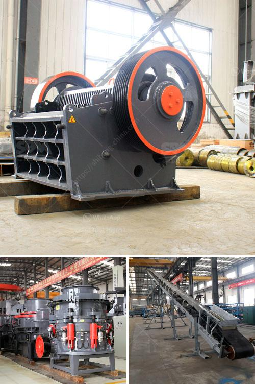

<h3>jaw crusher usa pakistan</h3>
Crushing is an essential process in the mining and quarrying industry. It serves as the primary stage for breaking rocks into smaller sizes and preparing them for further processing. Jaw crushers have emerged as a crucial equipment for this purpose, thanks to their robustness, versatility, and efficiency.

The United States and Pakistan are two nations that currently dominate the jaw crusher market. Here's a look at their backgrounds, along with a comparison of the jaw crusher industry in both countries.

The United States, located in North America, is the third largest country worldwide by land area and population. It possesses a highly developed and diversified economy, making it one of the most influential countries in the global market. The US mining industry is an integral part of its economy and is supported by advanced mining technologies, equipment, and machinery.

The United States has witnessed a constant demand for jaw crushers due to its vast range of applications. They are extensively used in the primary stage of the crushing process for various materials, including ores, minerals, rocks, and more. These crushers are designed to handle large rocks with their powerful crushing capabilities, resulting in reduced material sizes and enhanced efficiency.

Pakistan, situated in South Asia, is known for its rich reserves of natural resources, including minerals like coal, copper, gold, and limestone. The mining industry in Pakistan has become a significant contributor to its economy, providing employment opportunities and attracting foreign investment.

Jaw crushers have gained considerable popularity in Pakistan's mining industry due to their ability to crush large rocks into smaller sizes efficiently. They are widely used in the quarrying and mining industry as they offer high crushing ratios and a uniform final product size. In addition, jaw crushers are reliable, durable, and easy to maintain, making them a preferred choice for mining applications in Pakistan.

In terms of the jaw crusher market, the United States dominates due to its advanced technology, along with the presence of major jaw crusher manufacturers. The US manufacturer market continues to focus on innovation to meet the changing demands of the industry. They offer a wide range of jaw crushers with various features and specifications, catering to the diverse needs of customers.

On the other hand, Pakistan has seen a rise in local manufacturers who offer competitive solutions at affordable prices. These manufacturers have improved the accessibility of jaw crushers in the local market, making them more accessible to small-scale businesses and enterprises.

In conclusion, jaw crushers have revolutionized the mining and quarrying industry in both the United States and Pakistan. These powerful machines provide efficient crushing solutions for various materials, enhancing productivity and reducing overall operational costs. While the United States dominates in terms of technology and innovation, Pakistan's local manufacturers have made jaw crushers accessible to a wider range of customers. With continuous advancements and improvements, jaw crushers will remain an essential equipment in the mining and quarrying industry for years to come.
<h3>Contact us</h3><ul><li><strong>Whatsapp:&nbsp;<a href="https://wa.me/8613661969651">+8613661969651</a></strong></li><li><a href="https://swt.shibang-china.com/?git&amp;zhl&amp;jaw crusher usa pakistan"><strong>Online Service(chat now)</strong></a></li></ul><h3>Related</h3><ul><li><a href='iron ore melting plant supplier china.md'>iron ore melting plant supplier china</a></li><li><a href='ball mill pakistan for sale.md'>ball mill pakistan for sale</a></li><li><a href='used screens crushers for coal uk.md'>used screens crushers for coal uk</a></li><li><a href='raymond roller mills in kolkata.md'>raymond roller mills in kolkata</a></li><li><a href='clay crusher price.md'>clay crusher price</a></li></ul>