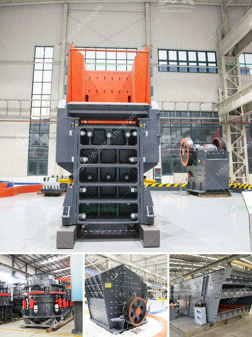

<h3>jaw crusher used india</h3>
India is blessed with abundant iron ore, copper ore, manganese ore, bauxite ore, gold ore, limestone, marble, granite, basalt, etc. From small stone quarries to large-scale mines, almost every ore mining site uses a jaw crusher. With the increasing demand for ore materials in the mining industry, jaw crushers have become indispensable equipment for crushing materials.

Jaw crushers are heavy-duty machines designed to crush large-sized rocks into smaller sizes for further processing. They are typically used in construction and mining industries to crush different types of rocks, including granite, basalt, quartz, gravel, and hard limestone, to name a few. The primary purpose of a jaw crusher is to reduce the size of the materials for subsequent processing. It achieves this by applying pressure to the materials using a fixed and movable jaw plate.

In India, the jaw crusher industry plays an essential role in enhancing the overall development of the mining industry. Jaw crushers are used in coal mines, construction waste recycling, metals, and non-metallic mineral processing. Chemical, cement, and other industries use jaw crushers for fine cutting, grinding, and fine crushing.

The Indian market for jaw crushers has been witnessing rapid growth in recent years. The major factors contributing to this growth are the rapid infrastructure development in the country, the increase in mining activities, and the rising demand for construction materials. India's government initiatives like "Make in India" and "Smart Cities Mission" have also boosted the demand for jaw crushers in the country.

Jaw crushers come in various sizes and specifications, catering to different requirements. The most common types of jaw crushers used in India are single toggle and double toggle jaw crushers. Single toggle jaw crushers are designed to operate with one jaw plate, whereas double toggle jaw crushers have two jaw plates that move in a fashion similar to human jaws. This design allows for better crushing efficiency and greater throughput.

The key advantages of jaw crushers include their simplicity of operation, reliability, and ease of maintenance. They are highly efficient in crushing various types of rocks and ores and can handle tough materials with ease. Additionally, jaw crushers have a higher crushing ratio, meaning that they can produce more fine-grained materials.

With technological advancements, jaw crushers have evolved to become more efficient and versatile. Modern jaw crushers come with advanced features like hydraulic adjustment, automatic lubrication, and remote control operation. These features make them easier to use and maintain, resulting in enhanced productivity and reduced downtime.

India, being a developing nation, relies heavily on the construction industry for its growth. Jaw crushers are essential equipment for the construction industry as they are used for crushing and recycling construction waste, which contributes to environmental sustainability. They are also used for quarrying and mining operations, extracting valuable minerals from the earth.

In conclusion, jaw crushers are widely used in India for various applications due to their versatility, efficiency, and reliability. These machines play a crucial role in reducing the size of rocks and ores, making them more manageable for further processing. With the ongoing infrastructure development in India and the increasing demand for construction materials, the jaw crusher industry is poised for continued growth in the coming years.
<h3>Contact us</h3><ul><li><strong>Whatsapp:&nbsp;<a href="https://wa.me/8613661969651">+8613661969651</a></strong></li><li><a href="https://swt.shibang-china.com/?git&amp;zhl&amp;jaw crusher used india"><strong>Online Service(chat now)</strong></a></li></ul><h3>Related</h3><ul><li><a href='raymond grinding mill machine.md'>raymond grinding mill machine</a></li><li><a href='stone crushing plants.md'>stone crushing plants</a></li><li><a href='brick machine canada suppliers.md'>brick machine canada suppliers</a></li><li><a href='used mobile jaw crusher sale.md'>used mobile jaw crusher sale</a></li><li><a href='clinker crsher plant for sale.md'>clinker crsher plant for sale</a></li></ul>