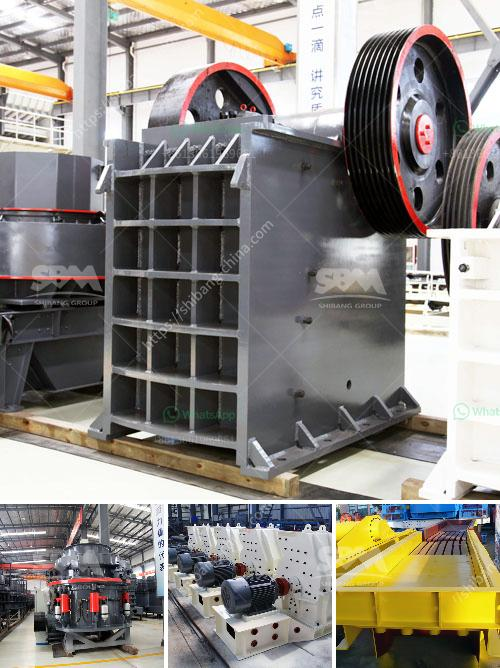

<h3>jaw crusher with production capacity of ton hr</h3>
The jaw crusher is commonly used as the primary crusher in a variety of stone production lines and ore crushing production lines, mainly crushing various ores and bulk materials with compressive strength not exceeding 320Mpa. It can process materials with a side length of less than 1000 mm, and has a large crushing ratio, high output, and stable operation. With the continuous development of the mining industry, the demand for jaw crushers with larger production capacity has also increased significantly.

A jaw crusher with a production capacity of 1-1000 tons per hour has been developed and put into use in many stone production lines. Its performance is stable and reliable, with high production efficiency and low failure rate. It is a product that users can trust.

Jaw crusher specifications and models are diversified, there are multiple combinations for customers to choose, from coarse crushing, intermediate crushing to fine crushing, it can meet the needs of different users. In addition, the jaw crusher has a large crushing ratio, high crushing efficiency, and low energy consumption.

The working principle of the jaw crusher is simple. The motor drives the belt and pulley to move the movable jaw up and down through the eccentric shaft. When the movable jaw rises, the angle between the toggle plate and the movable jaw becomes larger, thereby pushing the movable jaw plate closer to the fixed jaw plate. At this time, the crushed materials are discharged from the lower discharge opening of the crushing chamber. When the movable jaw descends, the angle between the toggle plate and the movable jaw decreases. Under the action of the pulling rod and spring, the movable jaw plate leaves the fixed jaw plate, and the crushed materials are discharged from the upper discharge opening of the crushing chamber.

The production capacity of a jaw crusher is directly related to the size and specifications of the machine. However, it also depends on the feeding size, hardness, and moisture content of the material. The higher the hardness of the material, the more difficult it is to crush, which will lead to a decrease in the production capacity of the jaw crusher. Similarly, if the moisture content of the material is high, it is prone to adhesion, which will also affect the production capacity.

In addition to the production capacity, the jaw crusher also has other advantages. For example, it has a small volume, lightweight structure, simple structure, reliable working condition, and low cost of accessories. It is a crushing equipment that customers like very much.

In summary, the jaw crusher with a production capacity of 1-1000 tons per hour is an advanced equipment in the crushing industry. The jaw crusher is developed on the basis of the traditional jaw crusher technology, and its technology is constantly improving. With the development of the mining industry, more and more jaw crushers with larger capacities are born, and jaw crushers with various specifications are widely used. As a common crushing equipment, the jaw crusher plays an important role in the stone production line and ore crushing production line, so it is necessary to effectively improve the production capacity of jaw crushers to survive in the fierce competition of market economy.
<h3>Contact us</h3><ul><li><strong>Whatsapp:&nbsp;<a href="https://wa.me/8613661969651">+8613661969651</a></strong></li><li><a href="https://swt.shibang-china.com/?git&amp;zhl&amp;jaw crusher with production capacity of ton hr"><strong>Online Service(chat now)</strong></a></li></ul><h3>Related</h3><ul><li><a href='quarry crusher with 60 tph.md'>quarry crusher with 60 tph</a></li><li><a href='lime stone screw conveyor.md'>lime stone screw conveyor</a></li><li><a href='used stone crushers from japan for sale.md'>used stone crushers from japan for sale</a></li><li><a href='chain conveyors crushers.md'>chain conveyors crushers</a></li><li><a href='conveyor belts supplier malaysia.md'>conveyor belts supplier malaysia</a></li></ul>