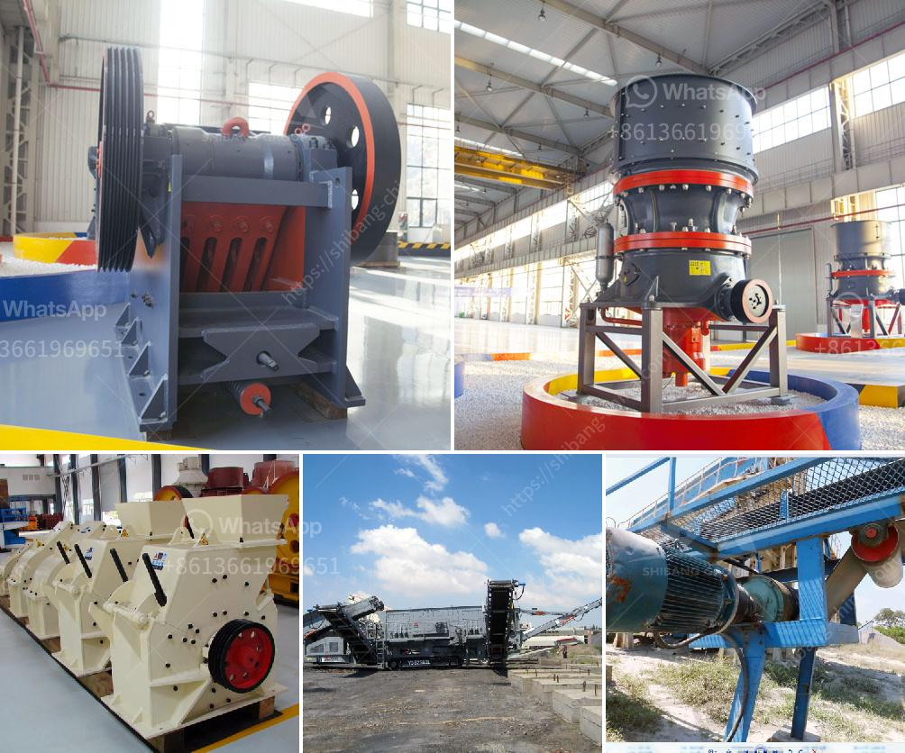

<h3>jaw crushers for sale in uganda</h3>
If you are in the market for a jaw crusher, you may have a difficult time finding the right machine for your needs. There are a number of factors you should consider when looking for a jaw crusher for sale in Uganda to ensure that the machine will be able to meet your specific needs.

One of the most important things to consider is the size of the jaw crusher. You will need to determine how much material you will be processing on a regular basis in order to choose the right size machine. A larger jaw crusher will be able to handle larger rocks and accommodate more material at once, while a smaller machine may be sufficient for smaller applications.

Another important factor to consider is the power source for the jaw crusher. Some machines are powered by electricity, while others are diesel-powered. The choice of power source will depend on your specific needs and the availability of electricity in your area. Diesel-powered machines may be more suitable for remote or off-grid locations where electricity may not be readily available.

You should also consider the capacity of the jaw crusher. The capacity will determine how much material the machine can process in a given period of time. It is important to choose a machine with a capacity that matches your production requirements. If you are unsure about the capacity you need, it is always better to opt for a machine with a higher capacity to ensure that you do not outgrow the machine too soon.

It is also important to consider the maintenance and operating costs of the jaw crusher. Some machines may require more frequent maintenance or have higher operating costs compared to others. It is important to factor in these costs when choosing a jaw crusher for sale. You should also consider whether or not there is local support or spare parts available for the machine in case of any maintenance or repair needs.

Additionally, it can be helpful to read reviews or seek recommendations from others in the industry who have experience with different jaw crusher models. Hearing about others' experiences can help you make a more informed decision and choose a reliable machine.

When looking for a jaw crusher for sale in Uganda, it is important to consider the size, power source, capacity, maintenance and operating costs, as well as reviews and recommendations. Taking the time to carefully evaluate these factors will help you choose the right machine for your specific needs.
<h3>Contact us</h3><ul><li><strong>Whatsapp:&nbsp;<a href="https://wa.me/8613661969651">+8613661969651</a></strong></li><li><a href="https://swt.shibang-china.com/?git&amp;zhl&amp;jaw crushers for sale in uganda"><strong>Online Service(chat now)</strong></a></li></ul><h3>Related</h3><ul><li><a href='small stone crushers ontario canada.md'>small stone crushers ontario canada</a></li><li><a href='jaw crusher equipment supplier.md'>jaw crusher equipment supplier</a></li><li><a href='ballast making machine kenya in kenya.md'>ballast making machine kenya in kenya</a></li><li><a href='sample quotation letter for sand and stone.md'>sample quotation letter for sand and stone</a></li><li><a href='lm vertical mill.md'>lm vertical mill</a></li></ul>