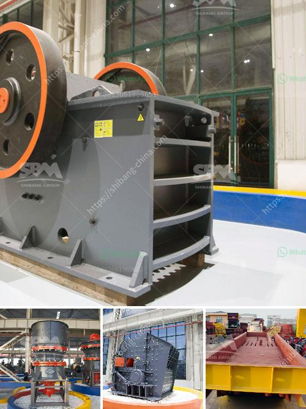

<h3>jaw crushers impact</h3>
Jaw crushers are heavy-duty machines designed to efficiently crush hard rocks by using compressive force. They are generally used as primary crushers in majority of crushing processes due to their reliability, versatility, and ability to crush hard materials. However, at times, the impact of jaw crushers can be quite harsh.

The impact created by the jaw crusher is an intense process. Crushing in a jaw crusher is performed by squeezing rock between two surfaces, one of which opens and closes like a jaw. Rock enters the crushing chamber from the top and moves through the chamber, which gets narrower as the material is crushed until it is small enough to pass through the gap at the bottom.

The impact of jaw crushers can be quite powerful, leading to excessive wear and tear of parts. Therefore, it is crucial to pay attention to maintenance and regular inspections to prevent these impacts from causing severe damage. By conducting proper maintenance, such as lubrication and replacing worn-out parts, the impact of jaw crushers can be minimized, thus extending their lifespan.

Additionally, the impact of jaw crushers on the environment should also be considered. Dust and noise pollution are common issues associated with jaw crushers, especially during the crushing process. Implementing proper dust control measures and sound insulation can significantly reduce the adverse impact on the environment.

Despite the potential impact of jaw crushers, their benefits outweigh the drawbacks in most cases. They are still widely used in various industries, including mining, construction, and recycling. Their versatility, high productivity, and ability to handle hard materials make them an indispensable tool in crushing operations.

In conclusion, jaw crushers can have a significant impact on crushing operations due to their powerful crushing mechanism. However, by implementing proper maintenance procedures, controlling dust and noise pollution, and utilizing preventive measures, the negative impacts can be minimized. Ultimately, jaw crushers remain essential equipment in many industries due to their reliability and versatility in efficiently crushing hard rocks.
<h3>Contact us</h3><ul><li><strong>Whatsapp:&nbsp;<a href="https://wa.me/8613661969651">+8613661969651</a></strong></li><li><a href="https://swt.shibang-china.com/?git&amp;zhl&amp;jaw crushers impact"><strong>Online Service(chat now)</strong></a></li></ul><h3>Related</h3><ul><li><a href='dry ball milling process.md'>dry ball milling process</a></li><li><a href='calcium carbonate powder machine.md'>calcium carbonate powder machine</a></li><li><a href='clay making process nigeria.md'>clay making process nigeria</a></li><li><a href='industrial mills for coal.md'>industrial mills for coal</a></li><li><a href='jaw crusher for sale in nigeria.md'>jaw crusher for sale in nigeria</a></li></ul>