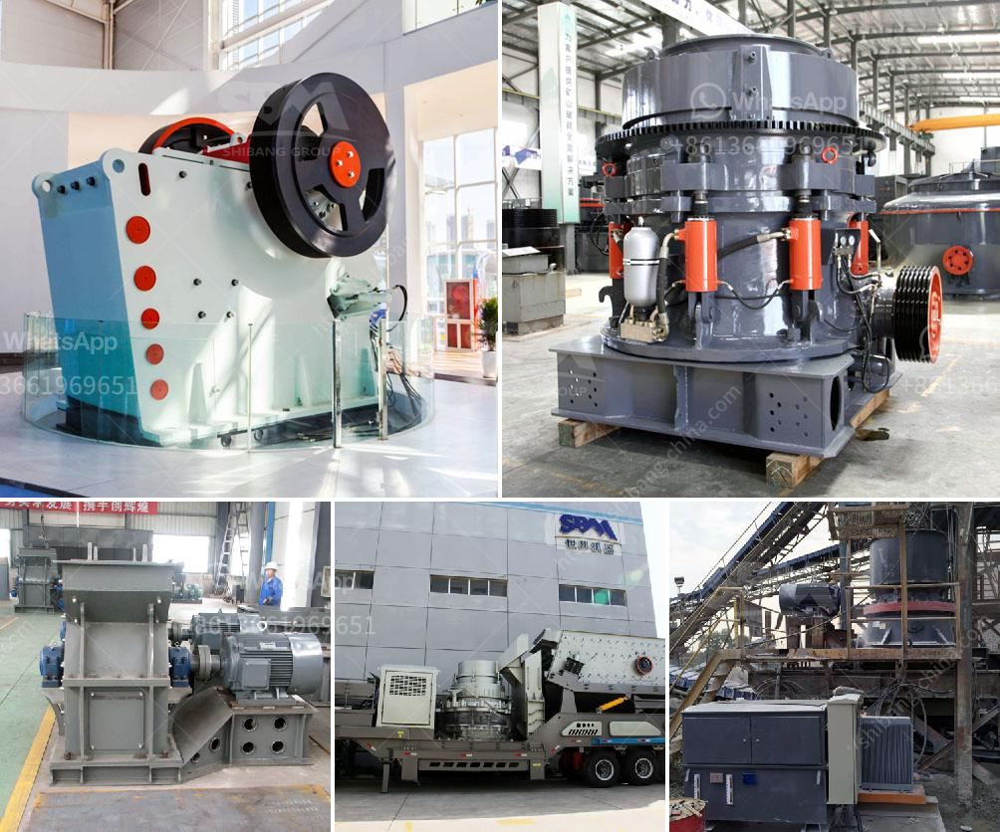

<h3>jaw crushers south africa</h3>
Jaw crushers are used as primary crushers in a mine or ore processing plant or the first step in the process of reducing rock. They are widely used in the mining industry, metallurgical industry, building material industry, railway industry, water conservancy and chemical industries. Jaw crushers have a big reduction ratio, high capacity and numerous other advantages.

South Africa is a major producer of coal, gold, platinum group metals, manganese ore, and vanadium. It has been a leading supplier of minerals in the world. The wealth of its mineral resources and the favourable investment climate make South Africa one of the most economically developed countries in Africa. Therefore, the mining industry is a major contributor to the South African economy.

Jaw crushers South Africa are typically used as primary crushers, or the first step in the process of reducing rock. They are considered highly efficient, reliable, and durable machines that provide a high reduction ratio with a consistent product size distribution. Jaw crushers are specifically designed to handle large feed sizes and are capable of crushing hard abrasive material efficiently.

The jaw crusher consists of a fixed jaw and a swing jaw. The swing jaw, which is inclined at an acute angle to the vertically fixed jaw, swings with the help of a pitman mechanism that is mounted on an eccentricshaft. The jaws are driven by electric motors, and through a belt drive, they rotate eccentrically at high speeds. As the material enters the crushing chamber, it is crushed between the fixed and the swing jaws, and then discharged through the discharge opening.

In South Africa, jaw crushers are most commonly used as primary crushers for the coarse crushing stage. They have a high crushing capacity and a wide range of applications that can handle various types of materials, including hard rock and ores. They are durable machines that offer a long lifespan, which is beneficial for businesses operating in the mining industry where the equipment is subjected to high wear and tear.

Another advantage of jaw crushers is their versatility. They can be used for both primary and secondary crushing, depending on the application requirements. This flexibility makes them suitable for a wide range of industries, including mining, quarrying, and construction. They can also be customized with various optional features to meet specific customer needs.

In conclusion, jaw crushers South Africa are an essential piece of equipment in the mining and minerals processing industry. They are used as primary crushers and have a high reduction ratio. They are robust machines capable of handling heavy-duty applications that require high production rates. With their widespread use in the South African mining industry, jaw crushers have proven to be efficient, reliable, and durable machines that contribute to the overall success of the industry.
<h3>Contact us</h3><ul><li><strong>Whatsapp:&nbsp;<a href="https://wa.me/8613661969651">+8613661969651</a></strong></li><li><a href="https://swt.shibang-china.com/?git&amp;zhl&amp;jaw crushers south africa"><strong>Online Service(chat now)</strong></a></li></ul><h3>Related</h3><ul><li><a href='coal mill grinding rolls.md'>coal mill grinding rolls</a></li><li><a href='gypsum washing equipment for sale.md'>gypsum washing equipment for sale</a></li><li><a href='stone crusher fairs.md'>stone crusher fairs</a></li><li><a href='limestone impact crusher wobbler.md'>limestone impact crusher wobbler</a></li><li><a href='stone crusher for tractor.md'>stone crusher for tractor</a></li></ul>