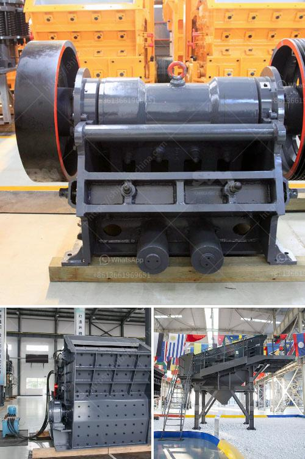

<h3>jaw crushing plant cost</h3>
When it comes to setting up a jaw crushing plant, there are many factors to consider in order to determine the most cost-effective solution for your needs. From variable speed drives and dust suppression systems to compatibility with different types of materials, it's essential to have a clear understanding of both the initial investment and the ongoing operational costs.

The primary cost factors associated with a jaw crushing plant include equipment costs, labor expenses, energy consumption, maintenance, and transportation. Let's take a closer look at each of these factors.

1. Equipment costs: The jaw crushing plant itself is a significant investment and comes with a hefty price tag. However, the cost can vary depending on the size, capacity, and functionality of the plant. Different manufacturers offer different options, so it's crucial to compare prices and specifications before making a final decision.

2. Labor expenses: Labor costs can also add up, especially if you need specialized technicians or operators to run and maintain the jaw crushing plant. The number of personnel required will depend on the complexity of the plant and the volume of material being processed.

3. Energy consumption: Operating a jaw crushing plant requires a significant amount of energy. The electricity consumption will depend on factors such as the size of the plant, the efficiency of the equipment, and the hardness of the materials being crushed. It's important to consider energy-saving features when choosing a crushing plant to help reduce operational costs.

4. Maintenance: Regular maintenance is essential to keep a jaw crushing plant operating at its optimal efficiency. Maintenance costs can include the replacement of wear parts, lubrication, and general repair work. It's essential to account for these ongoing costs when calculating the total cost of the plant over its lifetime.

5. Transportation: Depending on the location of your site and the availability of suitable aggregates, transportation costs can significantly impact the overall cost of a jaw crushing plant. It's important to factor in the cost of trucking or shipping materials to and from the plant when assessing its economic feasibility.

In addition to these primary cost factors, there are other considerations that may affect the overall cost of a jaw crushing plant. For instance, if you require additional features such as a vibrating feeder or a magnetic separator, it will add to the upfront cost of the equipment. Similarly, if you need to comply with strict environmental regulations, investing in dust suppression systems or air filtration units may be necessary, albeit adding to the overall cost.

It's worth noting that while the initial investment in a jaw crushing plant can be substantial, it can also bring long-term cost savings. The ability to produce high-quality aggregates on-site can reduce the need to purchase expensive imported materials. Additionally, if your operation relies heavily on aggregates, having a reliable stationary crushing plant can help ensure a steady supply and reduce reliance on external sources.

In conclusion, the cost of setting up and operating a jaw crushing plant can vary depending on various factors. It's crucial to carefully consider all cost elements, from equipment and labor expenses to energy consumption and maintenance, in order to make an informed decision. By doing so, you can determine the most cost-effective solution for your specific needs, ultimately optimizing your return on investment.
<h3>Contact us</h3><ul><li><strong>Whatsapp:&nbsp;<a href="https://wa.me/8613661969651">+8613661969651</a></strong></li><li><a href="https://swt.shibang-china.com/?git&amp;zhl&amp;jaw crushing plant cost"><strong>Online Service(chat now)</strong></a></li></ul><h3>Related</h3><ul><li><a href='ultra fine grinder mill.md'>ultra fine grinder mill</a></li><li><a href='industrial gypsum rotary kiln.md'>industrial gypsum rotary kiln</a></li><li><a href='coal conveyor problem.md'>coal conveyor problem</a></li><li><a href='kaolin crushing processing in india.md'>kaolin crushing processing in india</a></li><li><a href='granite crusher for sale.md'>granite crusher for sale</a></li></ul>