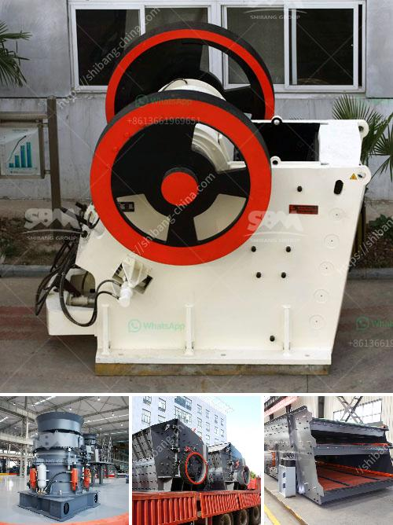

<h3>jaw impact crusher poland</h3>
The jaw impact crusher Poland is a popular industrial equipment used in mine, quarry, and construction industries. This powerful crusher has a robust design that ensures its durability and high performance. It utilizes two jaw plates to crush rocks or minerals, enabling efficient reduction of large-sized materials to smaller sizes for further processing.

One of the primary advantages of a jaw impact crusher is its versatility. It can handle various types of materials, including hard rocks, stones, and minerals. Whether it is limestone, granite, or basalt, this crusher can crush it effectively. This versatility makes it an ideal choice for a wide range of applications, such as mining, construction, and recycling.

The jaw impact crusher Poland is designed with a heavy-duty construction, featuring a sturdy frame, reinforced impact chambers, and wear-resistant plates. These features guarantee its reliability and long service life, even under demanding conditions. Furthermore, the crusher is equipped with a hydraulic system that allows for easy adjustment of the gap between the impact plates, ensuring optimal product size control.

In terms of performance, the jaw impact crusher Poland delivers excellent crushing capacity and high reduction ratios. Its powerful motor provides sufficient energy to crush even the toughest materials efficiently. The crusher's unique design also enables high throughput rates, ensuring quick processing of materials. This results in increased productivity and cost savings for the operators.

Additionally, the jaw impact crusher Poland is user-friendly and easy to operate. Its intuitive control panel allows for quick adjustment of various parameters to achieve the desired product size. The crusher's compact size and mobility make it convenient to transport and maneuver on-site. This flexibility allows for greater accessibility to remote areas where crushing operations are required.

Furthermore, the jaw impact crusher Poland is equipped with safety features to protect operators and prevent accidents. The machine is fitted with a sensor system that automatically stops the crusher when uncrushable objects, such as metal or wood, enter the crushing chamber. This feature reduces the risk of damage to the crusher and ensures operator safety.

Overall, the jaw impact crusher Poland is a reliable and versatile industrial equipment used for crushing various materials effectively. Its robust construction, high performance, and user-friendly features make it an excellent choice for applications in mining, quarry, and construction industries. Whether it is for primary crushing or secondary crushing, this crusher delivers exceptional results. With its durability, efficiency, and safety features, the jaw impact crusher Poland is a valuable asset for any industrial operation.
<h3>Contact us</h3><ul><li><strong>Whatsapp:&nbsp;<a href="https://wa.me/8613661969651">+8613661969651</a></strong></li><li><a href="https://swt.shibang-china.com/?git&amp;zhl&amp;jaw impact crusher poland"><strong>Online Service(chat now)</strong></a></li></ul><h3>Related</h3><ul><li><a href='business plan small scale gold mining.md'>business plan small scale gold mining</a></li><li><a href='quote for jaw crusher.md'>quote for jaw crusher</a></li><li><a href='types of cone crusher.md'>types of cone crusher</a></li><li><a href='sell stone crusher crushing plant feeder screen conveyors.md'>sell stone crusher crushing plant feeder screen conveyors</a></li><li><a href='production process of cement.md'>production process of cement</a></li></ul>