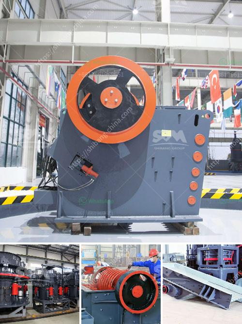

<h3>jaw stone crusher in turkey</h3>
Jaw stone crusher in Turkey is often used for primary and secondary crushing of various types of stones. The jaw crusher, which is also called a stone crusher, is widely used in different industries such as mining, construction, metallurgy, transportation, ceramics, cement, and chemical industries. With its sturdy construction and high-quality components, jaw crushers provide excellent crushing performance.

Turkey has plentiful resources of stones such as limestone, marble, dolomite, and other varieties of stones. Turkey is a major producer of various types of stones. Over the years, Turkey has invested a lot of money in the construction and development of infrastructure. This has led to an increase in the demand for jaw stone crushers in Turkey.

The jaw crushers are common types of rock crushing machines that can be found working at various construction sites all over the world. These machines are widely used in areas such as mining, quarrying, and recycling of construction waste. The primary function of a jaw crusher is to reduce large rocks into smaller stones.

One of the key benefits of using a jaw crusher is its ability to process large amounts of material at a rapid rate. This feature makes them ideal for processing large quantities of stone quickly and efficiently. Additionally, jaw crushers are known for their excellent performance in terms of reliability and durability.

Turkey has a fast-growing economy and construction sector. The government of Turkey has been implementing various development projects in recent years, including the construction of highways, bridges, and buildings. These projects have created a huge demand for construction materials such as stones, aggregates, and sands. As a result, the demand for jaw stone crushers in Turkey has been on the rise.

In Turkey, jaw stone crushers are primarily used to crush various types of stones and brick blocks into smaller pieces for construction purposes. This machine can be used in a wide range of applications such as mining, metallurgy, building materials, highways, railways, water conservancy, and chemical industries.

In recent years, Turkey has witnessed a growth in the use of jaw stone crushers. This growth can be attributed to the increase in urbanization and infrastructure development projects in the country. Additionally, growth in the construction sector has boosted the demand for jaw stone crushers in Turkey.

The jaw crushers manufactured by Turkish companies are highly reliable and durable. They are designed with state-of-the-art technology and come with various innovative features. These machines can handle even the toughest materials and offer high crushing ratios, ensuring high productivity and efficiency.

In conclusion, jaw stone crushers in Turkey are widely used in construction and infrastructure projects due to their reliable performance and excellent crushing capabilities. The increasing demand for jaw crushers in Turkey is mainly driven by the growth in the construction sector. With its strong economic growth and vast resources of various types of stones, Turkey is set to witness further development in the jaw crusher market.
<h3>Contact us</h3><ul><li><strong>Whatsapp:&nbsp;<a href="https://wa.me/8613661969651">+8613661969651</a></strong></li><li><a href="https://swt.shibang-china.com/?git&amp;zhl&amp;jaw stone crusher in turkey"><strong>Online Service(chat now)</strong></a></li></ul><h3>Related</h3><ul><li><a href='crushing plant aggregates in south africa.md'>crushing plant aggregates in south africa</a></li><li><a href='process of making talcum powder.md'>process of making talcum powder</a></li><li><a href='hammer crusher catalog pdf.md'>hammer crusher catalog pdf</a></li><li><a href='project cost of stone crusher of 100 tph.md'>project cost of stone crusher of 100 tph</a></li><li><a href='iron ore beneficiation poland.md'>iron ore beneficiation poland</a></li></ul>