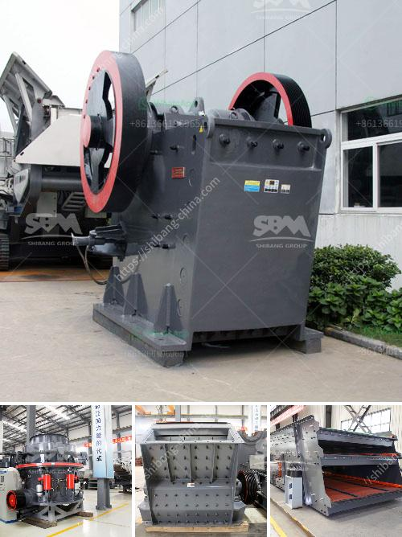

<h3>jual stone crusher merk</h3>
Stone crushing equipment is a vital necessity for various construction activities. It is also an essential equipment for municipalities, roadwork's, recycling centers, and various other industries. Regardless of the nature of their industries, organizations utilize this machinery to reduce the size of large rocks and stones into smaller and more manageable pieces. Among the prominent and reliable brands of stone crushers in the market is Jual Stone Crusher Merk.

Jual Stone Crusher Merk focuses on the production and distribution of various sizes and types of crushed stones. Their range of stone crushers include various sizes of stone crushers machines such as Jaw Crusher, Impact Crusher, Cone Crusher, and many more. These machines are capable of crushing rocks and stones efficiently and effectively.

What sets Jual Stone Crusher Merk apart from its competitors is its ability to produce and supply stone crushers that are specifically designed to cater to customer requirements. They consider factors such as the type of stone, the desired size, and the budget of the customer. Jual Stone Crusher Merk works closely with its clients to understand their needs and develops customized solutions to ensure customer satisfaction.

Furthermore, Jual Stone Crusher Merk also focuses on providing exceptional after-sales service. Their team of experts is readily available to assist clients with installation, servicing, and maintenance of their stone crushers. This not only ensures the smooth operation of the machines but also extends their lifespan, enabling customers to maximize their investment.

In addition to their excellent product quality and customer service, Jual Stone Crusher Merk also offers competitive prices that make their products accessible to a wide range of customers. They believe in providing quality at an affordable price, making them a preferred choice for many businesses and organizations.

In conclusion, Jual Stone Crusher Merk is a reliable choice for organizations looking for efficient and reliable stone crushing equipment. With their customized solutions, excellent after-sales service, and competitive prices, they have established themselves as a trusted brand in the market. Whether it is for roadwork's, construction, or recycling, Jual Stone Crusher Merk provides the necessary equipment to get the job done efficiently.
<h3>Contact us</h3><ul><li><strong>Whatsapp:&nbsp;<a href="https://wa.me/8613661969651">+8613661969651</a></strong></li><li><a href="https://swt.shibang-china.com/?git&amp;zhl&amp;jual stone crusher merk"><strong>Online Service(chat now)</strong></a></li></ul><h3>Related</h3><ul><li><a href='wet grinding mill china.md'>wet grinding mill china</a></li><li><a href='hydro classifier silica sand.md'>hydro classifier silica sand</a></li><li><a href='copper ore crusher.md'>copper ore crusher</a></li><li><a href='stone crusher machines in peru.md'>stone crusher machines in peru</a></li><li><a href='project report on quartz crusher industries.md'>project report on quartz crusher industries</a></li></ul>