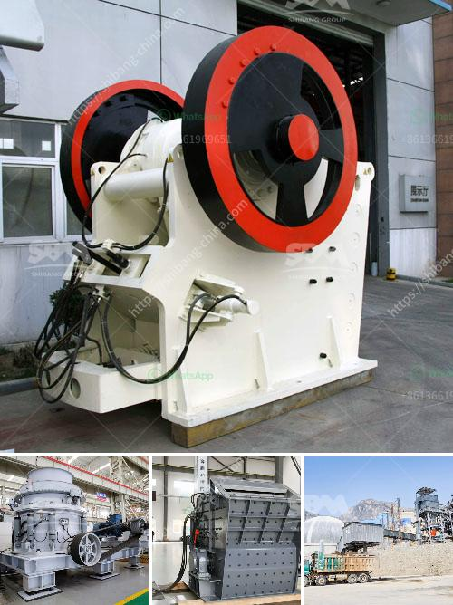

<h3>kaolin crushing processing in india</h3>
Kaolin, also known as china clay, is a white, soft, and plastic clay widely used in various industries such as ceramics, paper making, rubber, paints, and many more. In India, kaolin is primarily utilized in the paper industry due to its excellent brightness, smooth texture, and high printability. The kaolin crushing process plays a significant role in the paper manufacturing industry.

The jaw crusher is the primary crusher in this process. It processes large-sized raw kaolin materials into smaller particles for further treatment. Once the kaolin particles have been crushed to the desired size, they are transferred to the silo by the bucket elevator. It is important to note that the Kaolin is first dried before processing to ensure it is free from moisture, as excessive moisture can negatively impact the product quality.

Next, the dried kaolin particles are sent into the grinding mill for powdering. The fineness that can be achieved in this process depends on the specific requirements of the customer. There are two commonly used grinding mills for kaolin powder production: Raymond mill and micro powder mill. Raymond mill is suitable for processing fine powder with a particle size range of 30-400 mesh. Micro powder mill is capable of producing finer powder with a particle size range of 500-2500 mesh.

After the grinding process, the kaolin slurry is further processed in a hydrocyclone. The hydrocyclone helps separate the kaolin particles from other impurities, such as quartz and mica, by utilizing the principle of centrifugal force. The purified kaolin slurry is then sent to the deposition tank, where the kaolin particles settle at the bottom due to their higher density, while the impurities remain in suspension.

Once the kaolin particles have settled, they are dewatered and dried to remove any remaining moisture. The dried kaolin is then sent to the storage silo, ready for shipment to various industries. The entire kaolin crushing process is carefully monitored to ensure consistent quality and purity of the final product.

In India, the kaolin crushing process has witnessed immense growth over the years. With advancements in technology and increased demand from various industries, the kaolin processing industry in India is poised for further expansion. The favorable properties of kaolin, such as its low cost, abundance, and versatility, make it a highly sought-after material in various applications.

However, it is important to ensure sustainable mining practices to minimize the environmental impact of extracting and processing kaolin. Implementing responsible mining techniques and utilizing eco-friendly processing methods can help preserve the natural resources and minimize the ecological footprint of the kaolin industry.

In conclusion, kaolin crushing and processing play a crucial role in the paper manufacturing industry in India. The process involves multiple stages, including crushing, grinding, separation, and drying, to produce high-quality kaolin products. With the increasing demand for kaolin, it is essential to adopt sustainable practices to ensure the long-term viability of this industry.
<h3>Contact us</h3><ul><li><strong>Whatsapp:&nbsp;<a href="https://wa.me/8613661969651">+8613661969651</a></strong></li><li><a href="https://swt.shibang-china.com/?git&amp;zhl&amp;kaolin crushing processing in india"><strong>Online Service(chat now)</strong></a></li></ul><h3>Related</h3><ul><li><a href='price of rollers for conveyor belts.md'>price of rollers for conveyor belts</a></li><li><a href='silica sand mines in maharashtra.md'>silica sand mines in maharashtra</a></li><li><a href='cement plant ataustralia.md'>cement plant ataustralia</a></li><li><a href='stone crusher gangs in jamaica.md'>stone crusher gangs in jamaica</a></li><li><a href='material using for making talcum powder.md'>material using for making talcum powder</a></li></ul>