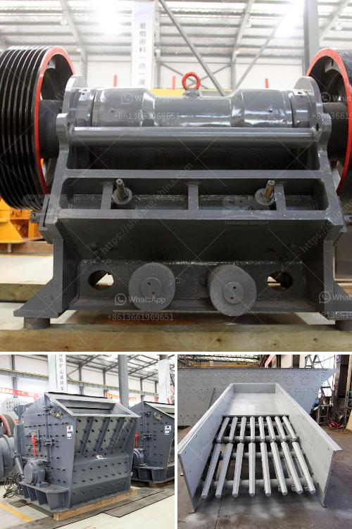

<h3>kaolin manufacturing process</h3>
Kaolin, also known as china clay or kaolinite, is a soft white clay mineral widely used in the manufacturing of various products. It is a key ingredient in ceramics, paper, paint, plastics, and many other important products. The manufacturing process of kaolin involves several stages to transform the raw ore into industrial-grade kaolin suitable for various applications.

The first step in the kaolin manufacturing process is excavation. It involves the stripping of overburden to expose the kaolin deposit underground. After extraction, the mined ore undergoes crushing to reduce the particle size and improve the overall quality of the material.

Next, the crushed ore is blunged, a process that mixes the crushed kaolin with water to form a slurry. The slurry is then passed through a series of filters to separate the coarse impurities, such as sand and rock, from the fine particles of kaolin. This helps to enhance the purity and brightness of the kaolin.

Once the slurry is filtered, it undergoes a process called centrifugation, where high-speed rotating equipment is used to separate the water from the kaolin particles. This process produces a thick paste known as filter cake, which contains approximately 20-30% moisture. The filter cake is then dried using various methods, such as spray drying or rotary drying, to reduce the moisture content to around 5%.

After drying, the kaolin undergoes further refining processes to remove any remaining impurities. These processes may include magnetic separation, froth flotation, or bleaching, depending on the quality requirements of the final product. Once the refining process is complete, the kaolin is ground into a fine powder to achieve the desired particle size distribution.

In the final stage of the kaolin manufacturing process, the powdered kaolin is either stored or transported for further use, depending on the intended application. The end product is a high-quality kaolin suitable for a wide range of industries, including ceramics, paper, rubber, and plastics.

Overall, the manufacturing process of kaolin involves a series of steps, including excavation, crushing, blunging, filtration, drying, refining, and grinding. Each step is crucial in producing high-quality kaolin with the desired characteristics for its intended applications. As a versatile mineral, kaolin continues to play a significant role in various industries worldwide.
<h3>Contact us</h3><ul><li><strong>Whatsapp:&nbsp;<a href="https://wa.me/8613661969651">+8613661969651</a></strong></li><li><a href="https://swt.shibang-china.com/?git&amp;zhl&amp;kaolin manufacturing process"><strong>Online Service(chat now)</strong></a></li></ul><h3>Related</h3><ul><li><a href='crushers in saudi arabia.md'>crushers in saudi arabia</a></li><li><a href='crusher machine for sale tanzania.md'>crusher machine for sale tanzania</a></li><li><a href='mill grinding machine for sale.md'>mill grinding machine for sale</a></li><li><a href='sand making machine zenith.md'>sand making machine zenith</a></li><li><a href='portable hydraulic rock crusher.md'>portable hydraulic rock crusher</a></li></ul>