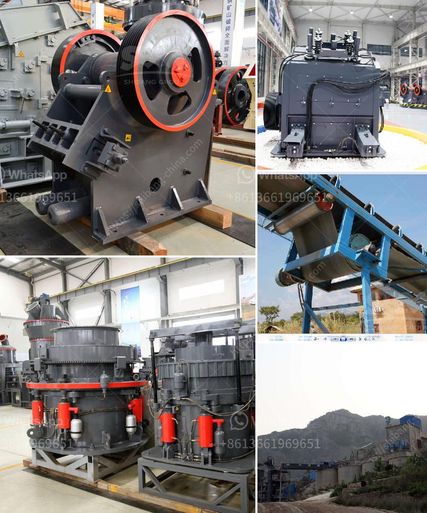

<h3>kaolin processing equipment fabricators in nigeria</h3>
Kaolin, a clay mineral deposit, is widely used in various industries in Nigeria. With a rise in demand for the mineral, its processing equipment fabricators in Nigeria are becoming more vital to keep up with its production.

Kaolin processing equipment fabricators in Nigeria is in great demand due to the ever-increasing population and rapid industrialization. Therefore, the need to venture into kaolin processing has become paramount and sustainable.

Kaolin is used as a filler, whitener, and coating agent in various industries such as paper, ceramics, rubber, paint, plastics, pharmaceuticals, and cosmetics. Its demand has increased due to its properties, including high green strength, excellent suspension, and fluidity characteristics, low shrinkage during firing, and resistance to high temperatures.

To meet the demand for kaolin, processing equipment fabricators in Nigeria have emerged to provide reliable and efficient machinery. These fabricators design and manufacture machines that process kaolin in large quantities, meeting the market's requirements and ensuring a steady supply.

Kaolin processing equipment fabricators in Nigeria work with advanced technology to process kaolin, remove impurities, and leave it pure. They may use methods such as washing, air classifying, pulverizing, drying, and magnetic separation. These processes ensure that the final product is refined for usage in various industries.

Additionally, these fabricators utilize modern machinery and equipment to ensure efficiency and productivity. They focus on minimizing production downtime and maximizing output to meet growing demand. The use of automated processes enables the processing of large quantities of kaolin in a shorter period, allowing for improved profitability.

Aside from processing, the equipment fabricators also provide maintenance and repair services for their machinery. This ensures that the processing equipment remains in optimal condition, minimizing breakdowns and increasing the lifespan of the machines. Their expertise and knowledge of kaolin processing equipment contribute to the sustainability of the industry.

Furthermore, the fabricators collaborate with kaolin miners to source raw materials. They often establish partnerships with local mining communities, promoting economic development in those areas. This collaborative approach ensures a consistent supply of raw materials and supports local businesses.

In conclusion, kaolin processing equipment fabricators in Nigeria play a crucial role in meeting the ever-growing demand for kaolin in various industries. They utilize advanced technology and machinery to process and refine kaolin to meet market requirements. These fabricators not only contribute to the sustainable development of the kaolin industry but also support local mining communities by establishing partnerships. With their expertise and commitment to quality, they ensure a steady supply of high-quality kaolin to meet Nigeria's industrial needs.
<h3>Contact us</h3><ul><li><strong>Whatsapp:&nbsp;<a href="https://wa.me/8613661969651">+8613661969651</a></strong></li><li><a href="https://swt.shibang-china.com/?git&amp;zhl&amp;kaolin processing equipment fabricators in nigeria"><strong>Online Service(chat now)</strong></a></li></ul><h3>Related</h3><ul><li><a href='olx used crusher machines.md'>olx used crusher machines</a></li><li><a href='granite rock breaking machine manufacturer in mlaysia.md'>granite rock breaking machine manufacturer in mlaysia</a></li><li><a href='river stone crusher plant for sale in india.md'>river stone crusher plant for sale in india</a></li><li><a href='how to decrease the dust in a crushing plant.md'>how to decrease the dust in a crushing plant</a></li><li><a href='mobile crusher parker 50th crusher for sale.md'>mobile crusher parker 50th crusher for sale</a></li></ul>