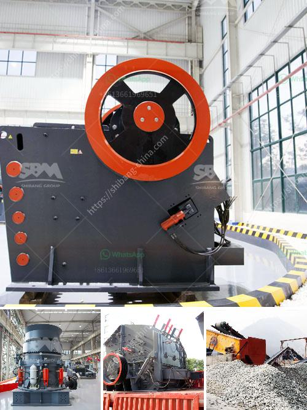

<h3>kaolin processing plant south africa</h3>
Kaolin is a kind of non-metallic mineral, that is mainly composed of kaolinite clay. Due to the pure whiteness, creamy texture, and soft features, kaolin is widely used all over the world in various industries including papermaking, ceramics, rubber, paint, chemical, pharmaceutical, and even cosmetic. South Africa is a country rich in kaolin deposits, and there is a growing demand for kaolin products.

In recent years, South Africa's kaolin processing plant development has been driven by the strong demand for kaolin-rich ores, fueled by the country's booming construction industry, which has created a huge market for local kaolin producers. Besides, the continuous development of the country's infrastructure has also served as a boost to the kaolin industry.

Kaolin processing plants in South Africa have achieved great success in recent years due to the continuous advancement in mining technology and equipment. It uses high-pressure powder mill, and is equipped with dust removal equipment, which effectively prevents dust pollution and improves the working environment. These advanced technologies, along with the various kaolin processing plants, have enabled South Africa to expand its market share in the global kaolin market.

As one of the leading kaolin producers in the world, South Africa is blessed with abundant kaolin resources. The kaolin mining industry in South Africa has been well developed and mature. Many local enterprises have invested heavily in kaolin processing plants, making the kaolin market maintain a relatively stable growth rate.

The large-scale kaolin processing plant in South Africa mainly processes raw kaolin by grinding, classifying and purifying. The purified kaolin products can be used in ceramics, medicine, coating, and other fields.

With the continuous advancement of science and technology, the kaolin processing plant in South Africa adopts the most advanced and efficient technology, and has quickly occupied a considerable share of the kaolin market. Moreover, the export volume of South Africa's kaolin used in other countries has also increased, further boosting the development of kaolin processing plants.

In conclusion, South Africa's kaolin processing plants boast favorable conditions, allowing for the continuous growth of the kaolin industry. With a rich reserve of high-quality kaolin ore, advanced processing technologies, and a stable market demand, the future of South Africa's kaolin processing plants appears promising.
<h3>Contact us</h3><ul><li><strong>Whatsapp:&nbsp;<a href="https://wa.me/8613661969651">+8613661969651</a></strong></li><li><a href="https://swt.shibang-china.com/?git&amp;zhl&amp;kaolin processing plant south africa"><strong>Online Service(chat now)</strong></a></li></ul><h3>Related</h3><ul><li><a href='aggregate crushers south africa.md'>aggregate crushers south africa</a></li><li><a href='conveyor belts for shelves.md'>conveyor belts for shelves</a></li><li><a href='cost per hour mobile crusher.md'>cost per hour mobile crusher</a></li><li><a href='iron ore crushing process.md'>iron ore crushing process</a></li><li><a href='porur raymond grinding mill.md'>porur raymond grinding mill</a></li></ul>