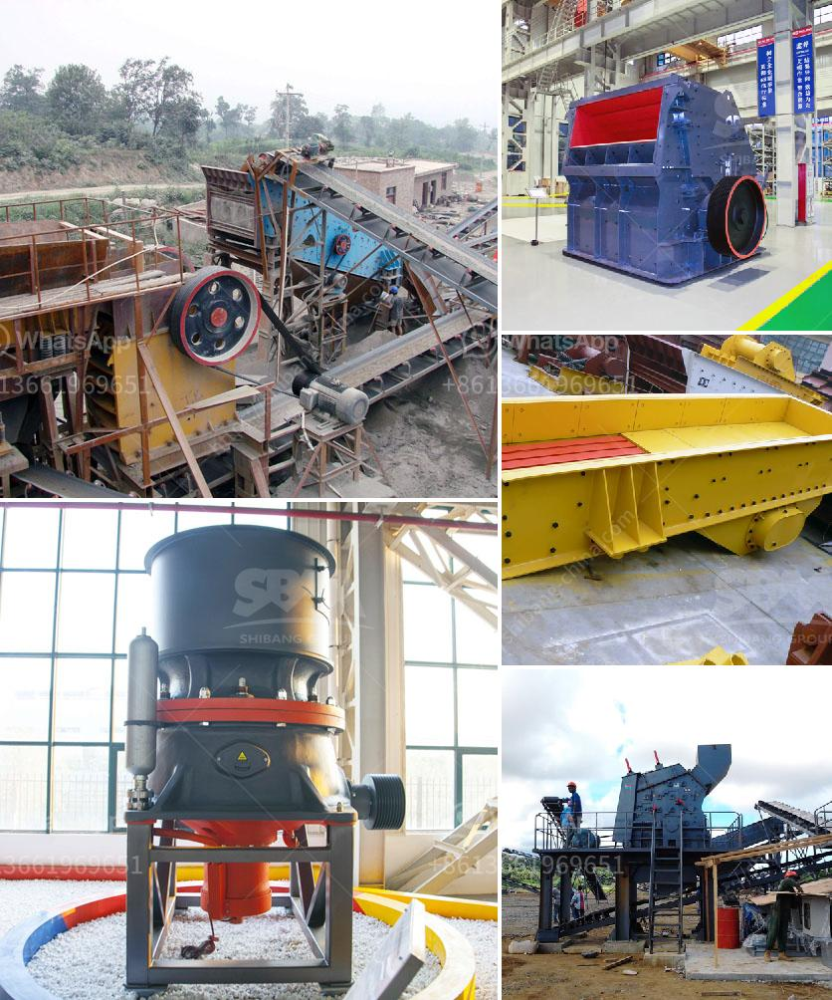

<h3>kenya raymond mill</h3>
Kenya, located in the eastern part of Africa, is home to rich mineral resources. With the strengthening of industrialization efforts, the mining industry in Kenya has experienced rapid development in recent years. As a key equipment in the mining industry, Raymond mill has played a crucial role in the overall development of Kenya.

Raymond mill, also known as Raymond roller mill, is commonly used in industrial applications in the mining industry to grind various minerals and materials. It is widely used in fields such as cement, silicate products, new building materials, refractory materials, fertilizers, black and non-ferrous metal beneficiation, and glass ceramics. With its unique performance advantages and high grinding efficiency, Raymond mill has become an indispensable equipment in the mining industry.

One of the significant advantages of Raymond mill is its environmental performance. In the mining industry, environmental protection has become an increasingly important issue. Raymond mill adopts advanced milling technology and is equipped with a unique dust removal system, effectively reducing dust pollution and creating a clean production environment. In addition, Raymond mill has a low noise level, which further reduces environmental noise pollution. This makes it an ideal choice for countries like Kenya, where environmental protection is highly valued.

Furthermore, Raymond mill has a wide range of applications in the mining industry in Kenya. It can be used to grind various materials, including limestone, calcite, marble, barite, gypsum, talc, and dolomite. These minerals are commonly found in Kenya and are widely used in various industries such as construction, agriculture, and manufacturing. The utilization of Raymond mill in the processing of these materials can greatly improve their utilization value and promote the economic development of Kenya.

Another reason why Raymond mill is favored in Kenya's mining industry is its high grinding efficiency. The advanced grinding principle and structure design of Raymond mill ensure the high grinding efficiency and stable operation. The grinding fineness can reach 80-400 mesh, which meets the requirements of most mining applications. Moreover, Raymond mill has a strong adaptability to materials, allowing for continuous and stable production even when processing materials with different hardness and humidity.

In summary, Raymond mill has brought significant benefits to the mining industry in Kenya. Its environmental performance, wide range of applications, and high grinding efficiency have made it an essential equipment for the sustainable development of the mining industry. As the mining industry continues to grow in Kenya, Raymond mill will continue to play a crucial role in promoting green development and realizing sustainable mining practices. With continuous technological advancements, it is expected that Raymond mill will further contribute to the economic growth of Kenya's mining industry while minimizing its environmental impact.
<h3>Contact us</h3><ul><li><strong>Whatsapp:&nbsp;<a href="https://wa.me/8613661969651">+8613661969651</a></strong></li><li><a href="https://swt.shibang-china.com/?git&amp;zhl&amp;kenya raymond mill"><strong>Online Service(chat now)</strong></a></li></ul><h3>Related</h3><ul><li><a href='crusher plant in rajasthan.md'>crusher plant in rajasthan</a></li><li><a href='jaw crusher specifications.md'>jaw crusher specifications</a></li><li><a href='silica sand washing plant.md'>silica sand washing plant</a></li><li><a href='jaw crusher for rent indonesia.md'>jaw crusher for rent indonesia</a></li><li><a href='zinc crusher machine zimbabwe.md'>zinc crusher machine zimbabwe</a></li></ul>