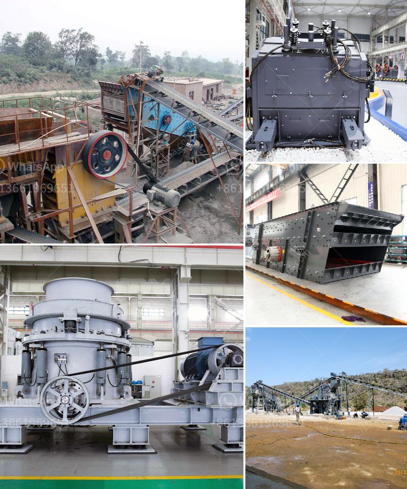

<h3>kenya vibrating screen is manufactured</h3>
The industrial landscape in Kenya has been rapidly growing, and various industries have seen a spike in their operations in recent years. With this growth comes the need for advanced machinery and equipment to enhance efficiency and productivity. One such essential equipment that has gained popularity in Kenya is the vibrating screen.

The vibrating screen is a versatile piece of equipment that is used in various industries to efficiently sort, size, and screen different materials. It is widely used in the mining, agriculture, construction, recycling, and chemical industries, among others. The vibrating screen helps in separating the valuable materials from the waste or unwanted particles, ensuring a high-quality final product.

In Kenya, vibrating screens are manufactured to meet the specific needs and requirements of the local industries. These screens are designed and engineered to withstand the harsh environmental conditions and heavy-duty operations. They are manufactured using high-quality materials and cutting-edge technology to ensure durability and long-lasting performance.

One of the key features of the vibrating screens manufactured in Kenya is their ability to handle different types of materials. Whether it is fine particles, coarse aggregates, or even wet materials, these screens are designed to efficiently handle them all. This versatility makes them ideal for various applications, including screening ore, stone, sand, gravel, and even food products.

Another important aspect of the vibrating screens manufactured in Kenya is their efficiency. These screens are designed to maximize the screening efficiency by utilizing multiple decks and adjustable screening angles. This allows for better control over the screening process, ensuring a high level of accuracy and precision.

Additionally, the vibrating screens manufactured in Kenya are equipped with advanced technology and features to enhance productivity. They are easy to operate and maintain, reducing downtime and maximizing overall efficiency. Some screens are also equipped with self-cleaning mechanisms for hassle-free operation and reduced maintenance requirements.

Furthermore, the vibrating screens manufactured in Kenya are available in various sizes and configurations to meet the specific needs of different industries. Whether it is a small-scale operation or a large industrial plant, there is a vibrating screen suitable for every requirement.

While the demand for vibrating screens continues to rise in Kenya, the local manufacturers are committed to providing high-quality equipment that adheres to international standards. These manufacturers invest in research and development to improve their products and stay up to date with the latest advancements in technology.

In conclusion, the vibrating screens manufactured in Kenya are essential equipment in a wide range of industries. They play a crucial role in improving efficiency and productivity by separating valuable materials from unwanted particles. These screens are designed to withstand harsh conditions and heavy-duty operations, ensuring durability and long-lasting performance. With their versatility and efficiency, vibrating screens have become an invaluable asset to the Kenyan industrial sector.
<h3>Contact us</h3><ul><li><strong>Whatsapp:&nbsp;<a href="https://wa.me/8613661969651">+8613661969651</a></strong></li><li><a href="https://swt.shibang-china.com/?git&amp;zhl&amp;kenya vibrating screen is manufactured"><strong>Online Service(chat now)</strong></a></li></ul><h3>Related</h3><ul><li><a href='rock crusher price.md'>rock crusher price</a></li><li><a href='small rock crusher portable gold mining.md'>small rock crusher portable gold mining</a></li><li><a href='cement manufacturing process ppt.md'>cement manufacturing process ppt</a></li><li><a href='powder production line price.md'>powder production line price</a></li><li><a href='roller crusher in egypt.md'>roller crusher in egypt</a></li></ul>