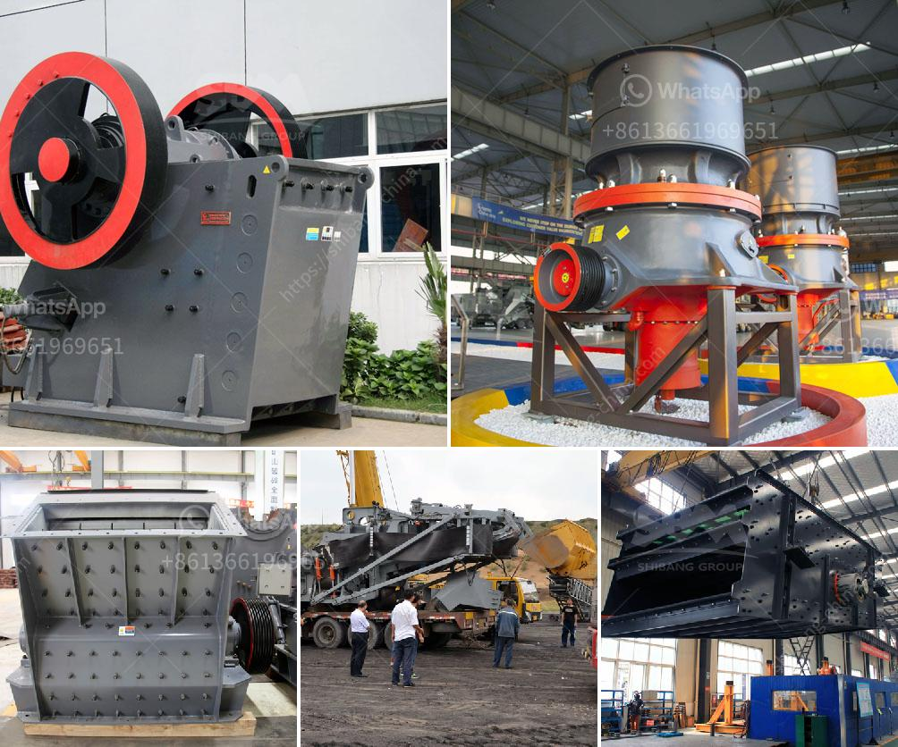

<h3>komatsu br200 mobile crushers for sale</h3>
Komatsu BR200 mobile crushers are powerful and efficient machines that are designed to crush rocks and other hard materials. They have a high crushing force and a large processing capacity that allows them to handle even the toughest materials with ease.

One of the main advantages of these machines is their mobility. The compact design and lightweight construction make them easy to transport, allowing them to be used in various sites and locations. Whether it's a quarry, construction site, or mining operation, these mobile crushers can be easily transported to the desired location, saving time and effort.

The Komatsu BR200 mobile crushers are known for their reliability and durability. They are built to withstand the harsh conditions of the job site and are designed to last for years. With regular maintenance and proper care, these crushers can provide efficient performance and high productivity for a long time.

Another notable feature of the Komatsu BR200 mobile crushers is their versatility. These machines can be equipped with various attachments and additional equipment such as grizzly feeders, magnetic separators, and dust suppression systems. This allows for customization according to specific needs and requirements, making them suitable for a wide range of applications.

When it comes to safety, the Komatsu BR200 mobile crushers are equipped with advanced features to ensure the well-being of the operators. Built-in safety systems and ergonomic design make these machines safe and easy to operate. Additionally, the remote control option allows operators to control the crushers from a safe distance, further enhancing safety on the job site.

In conclusion, the Komatsu BR200 mobile crushers are reliable, efficient, and versatile machines that offer high performance and productivity. With their mobility, durability, and advanced safety features, these crushers are an ideal choice for any construction or mining operation. If you are in the market for a mobile crusher, consider the Komatsu BR200 for its exceptional quality and efficiency.
<h3>Contact us</h3><ul><li><strong>Whatsapp:&nbsp;<a href="https://wa.me/8613661969651">+8613661969651</a></strong></li><li><a href="https://swt.shibang-china.com/?git&amp;zhl&amp;komatsu br200 mobile crushers for sale"><strong>Online Service(chat now)</strong></a></li></ul><h3>Related</h3><ul><li><a href='grinder mill powder singapore.md'>grinder mill powder singapore</a></li><li><a href='iron ore melting plant supplier china.md'>iron ore melting plant supplier china</a></li><li><a href='bentonite mill project report.md'>bentonite mill project report</a></li><li><a href='mobile crusher for salt.md'>mobile crusher for salt</a></li><li><a href='35 in raymond vertical roller mill.md'>35 in raymond vertical roller mill</a></li></ul>