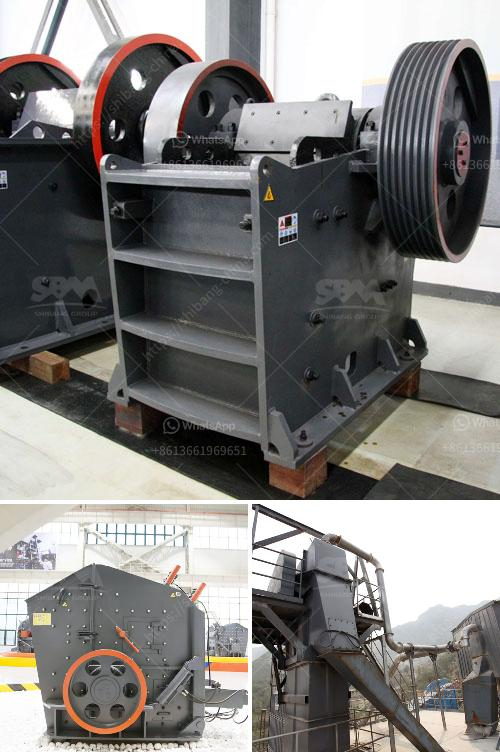

<h3>komatsu japan mobile debris crusher</h3>
In today's world, waste management has become one of the crucial aspects of sustainable development. Countries across the globe are constantly exploring innovative ways to handle waste effectively and reduce its impact on the environment. Komatsu, a renowned name in heavy machinery, has introduced a game-changing solution with its Japan Mobile Debris Crusher.

The Komatsu Japan Mobile Debris Crusher is a state-of-the-art machine that can efficiently crush construction and demolition waste into reusable materials. This mobile crusher boasts a high mobility, allowing it to easily navigate through narrow pathways and crowded construction sites. Whether it's concrete, bricks, asphalt, or other debris, this crusher can process it all.

One of the most notable features of this crusher is its environmental friendliness. It is designed to minimize dust and noise pollution, making it suitable for urban areas where noise restrictions are in place. The advanced technology used in the crusher ensures a low emission of harmful gases, contributing to cleaner air.

Furthermore, the crusher's compact size allows it to be transported easily, making it a versatile solution for waste management in various locations. It can be quickly deployed on construction sites, reducing the need for separate waste management facilities. This not only saves time and costs but also enhances efficiency in handling construction and demolition waste.

The utilization of the Komatsu Japan Mobile Debris Crusher also reduces the volume of waste sent to landfills. By crushing and repurposing the debris, it helps conserve natural resources and minimizes the need for new raw materials. It is a step towards a circular economy, where waste is considered a valuable resource rather than a burden.

Komatsu's commitment to sustainable development is evident through its innovative solutions like the Japan Mobile Debris Crusher. By rethinking waste management, this machine is playing a significant role in achieving a cleaner and greener future. With its efficiency, mobility, and environmental benefits, the crusher is gaining popularity as an essential tool in the construction industry.

In conclusion, the Komatsu Japan Mobile Debris Crusher is revolutionizing waste management in the construction industry. Combining mobility, efficiency, and environmental sustainability, this crusher is making a remarkable impact in handling construction and demolition waste. Alongside technological advancements, it is paving the way towards a more sustainable future, where waste is managed responsibly. Komatsu's commitment to innovation and sustainable development is commendable, and this crusher is a testament to the company's effort towards creating a greener planet.
<h3>Contact us</h3><ul><li><strong>Whatsapp:&nbsp;<a href="https://wa.me/8613661969651">+8613661969651</a></strong></li><li><a href="https://swt.shibang-china.com/?git&amp;zhl&amp;komatsu japan mobile debris crusher"><strong>Online Service(chat now)</strong></a></li></ul><h3>Related</h3><ul><li><a href='vibrating screen prices.md'>vibrating screen prices</a></li><li><a href='cement plant machinery list.md'>cement plant machinery list</a></li><li><a href='mill grinding machine for sale.md'>mill grinding machine for sale</a></li><li><a href='suppliers of chromite sand from south africa.md'>suppliers of chromite sand from south africa</a></li><li><a href='limestone mobile crusher supplier in malaysia.md'>limestone mobile crusher supplier in malaysia</a></li></ul>