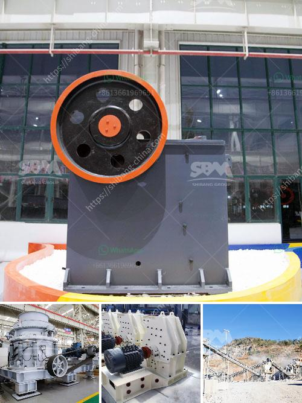

<h3>komatsu mobile crushers price</h3>
Komatsu mobile crushers are a popular choice for construction sites due to their durability, reliability, and efficiency in crushing materials as well as their highly advanced technology. These machines are known for their superior performance and high versatility, making them the perfect choice for any construction project. In this article, we will discuss the price of Komatsu mobile crushers and why they are worth every penny.

Komatsu mobile crushers come in various sizes and models, each offering different capabilities and specifications. The price of each model depends on its features, size, capacity, and other factors. Generally, the prices range from $80,000 to $550,000.

One of the primary factors that contribute to the price of a Komatsu mobile crusher is its capacity. Higher capacity machines are generally more expensive as they are capable of crushing larger quantities of materials in a shorter amount of time. If your construction project requires crushing large quantities of materials regularly, it may be worth investing in a higher capacity Komatsu mobile crusher.

Another factor that influences the price of Komatsu mobile crushers is the technology used in them. Komatsu incorporates advanced features in their machines to ensure optimum performance and efficiency. These features include intelligent control systems, GPS tracking, remote monitoring, and automated processes. While these advanced technologies add to the price, they also enhance the productivity and performance of the machine, making it a valuable investment in the long run.

Komatsu mobile crushers are built to withstand the toughest environments and handle various types of materials, ranging from rocks and stones to recyclable materials like concrete and asphalt. Their robust construction ensures durability and longevity, reducing the need for frequent repairs or replacements. This reliability translates into lower maintenance costs, saving you money in the long term.

Furthermore, Komatsu mobile crushers are designed with operator comfort and safety in mind. Ergonomic controls, spacious cabins, and excellent visibility ensure that operators can work efficiently and safely for extended periods.

When considering the price of Komatsu mobile crushers, it is essential to look beyond the initial cost. These machines have a proven track record in the construction industry and offer a high return on investment. Their durability, reliability, and advanced technology contribute to increased productivity, reduced downtime, and lower maintenance costs, making them a cost-effective choice for any construction site.

In conclusion, Komatsu mobile crushers are an excellent choice for construction sites due to their durability, reliability, and advanced technology. While the price may vary depending on the model and capacity, these machines offer a high return on investment. By investing in a Komatsu mobile crusher, you can benefit from increased productivity, reduced maintenance costs, and overall efficiency in your construction projects.
<h3>Contact us</h3><ul><li><strong>Whatsapp:&nbsp;<a href="https://wa.me/8613661969651">+8613661969651</a></strong></li><li><a href="https://swt.shibang-china.com/?git&amp;zhl&amp;komatsu mobile crushers price"><strong>Online Service(chat now)</strong></a></li></ul><h3>Related</h3><ul><li><a href='used stone crushers for sale india.md'>used stone crushers for sale india</a></li><li><a href='silica sand screening plant.md'>silica sand screening plant</a></li><li><a href='carbomer ball mill.md'>carbomer ball mill</a></li><li><a href='chrome ore mining plant sudan.md'>chrome ore mining plant sudan</a></li><li><a href='europe crusher producers.md'>europe crusher producers</a></li></ul>