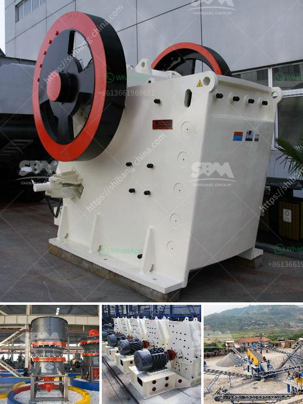

<h3>labaratory ball mill for minerals</h3>
A laboratory ball mill is used for grinding in laboratories for mineral processing. This grinder utilizes cylindrical jars in which grinding media is placed inside. The jar is rotated and the sample is ground due to impact and friction from the balls. The ground sample is then used for various purposes such as X-ray diffraction, elemental analysis, crystallinity analysis, and physical property analysis.

The laboratory ball mill is especially suited for sample preparation work in the laboratory of industrials of nonferrous metal, metallurgy, chemical, environment protection, scientific research fields, and so on. It can carry out grinding in both wet and dry conditions.

One of the important advantages of the laboratory ball mill is its ability to pulverize various kinds of ores and other grindable materials. With its wide range of applications, it allows for more accurate analyses in various research and development departments in industries dealing with minerals, metallurgy, and in academic research institutions.

The laboratory ball mill is equipped with a variety of loading and unloading methods, which makes it easy to operate and adjust. It has a low noise level and requires less energy expenditure than other types of grinding mills. It also provides a high degree of reliability, saving both time and money for the user.

In addition, the laboratory ball mill is not only efficient but also versatile. It can perform batch grinding, continuous grinding, and intermittent grinding. It is suitable for grinding both wet and dry materials. This means that it can be used for grinding minerals such as gold, iron ore, copper, and other materials, whether in wet or dry conditions.

The laboratory ball mill has been widely used in mineral processing because of its simple structure, wide range of applications, and low maintenance costs. It is specifically designed for grinding samples in laboratories of various industries such as metallurgy, chemical, and environmental protection.

It is important to note that the laboratory ball mill requires skilled operators who possess certain knowledge about grinding processes and equipment maintenance. Operators need to understand the principles of grinding and be familiar with the correct installation and operation procedures. This will ensure the safety of personnel and equipment, as well as the accuracy of the grinding process.

In conclusion, a laboratory ball mill is a versatile and efficient tool for grinding minerals and other materials in research laboratories and industries dealing with minerals. Its wide range of applications, ease of operation, and low maintenance costs make it an essential tool for laboratories and industries that deal with minerals. With the right training and proper use, the laboratory ball mill can greatly enhance the productivity and accuracy of grinding processes, hence contributing to advancements in various fields of research and development.
<h3>Contact us</h3><ul><li><strong>Whatsapp:&nbsp;<a href="https://wa.me/8613661969651">+8613661969651</a></strong></li><li><a href="https://swt.shibang-china.com/?git&amp;zhl&amp;labaratory ball mill for minerals"><strong>Online Service(chat now)</strong></a></li></ul><h3>Related</h3><ul><li><a href='horizontal shaft impact crusher.md'>horizontal shaft impact crusher</a></li><li><a href='how to make a stone crusher mining.md'>how to make a stone crusher mining</a></li><li><a href='mini gold ore wash plant plans.md'>mini gold ore wash plant plans</a></li><li><a href='difference between pebble and stone.md'>difference between pebble and stone</a></li><li><a href='how to start a stone quarry business.md'>how to start a stone quarry business</a></li></ul>