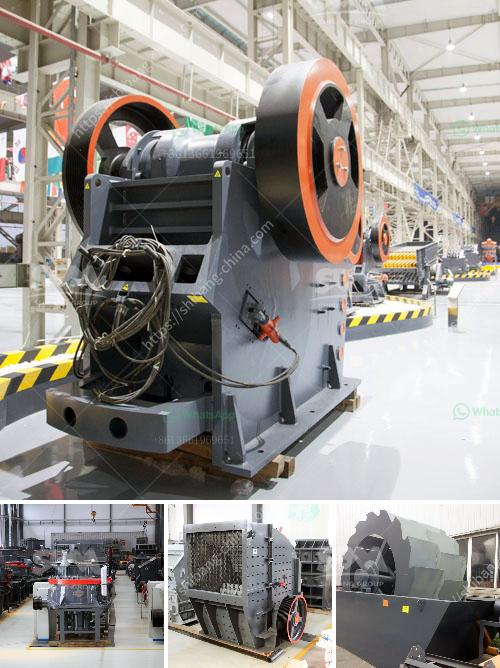

<h3>laborte crusing plant</h3>
The world's demand for raw materials has been steadily increasing over the past few decades, leading to the development of various industries focused on extracting these valuable resources. One such industry is the laborte crushing plant, a facility designed to process rocks and stones into gravel, sand, and other construction materials.

Laborte crushing plants are essential in supporting urban development and infrastructure projects. They play a crucial role in creating the necessary materials needed for constructing highways, buildings, and bridges. The process begins with the extraction of raw materials from quarries or mines. Large rocks and stones are then transported to the laborte crushing plant, where they are crushed into smaller pieces.

The primary crusher, usually a jaw crusher or gyratory crusher, takes the biggest rocks and breaks them down into more manageable sizes. These crushed materials are then transported to secondary crushers, such as cone crushers or impact crushers, for further processing. The final product is usually in the form of gravel, sand, or crushed stone, which is then used in various construction projects.

Laborte crushing plants are designed to be highly efficient, with the capacity to crush large quantities of materials in a short amount of time. This allows construction companies to meet project deadlines and keep up with the demand for construction materials. Additionally, these plants are equipped with advanced technology and machinery to ensure the production of high-quality materials.

Moreover, laborte crushing plants prioritize environmental sustainability. Advanced dust control measures are implemented to minimize air pollution and protect the surrounding environment. Furthermore, the plants are designed to optimize resource usage, reducing waste and maximizing the extraction of valuable materials.

In conclusion, laborte crushing plants play a crucial role in the construction industry by providing essential materials for infrastructure projects. Their efficiency and commitment to environmental sustainability make them an integral part of modern urban development. As the demand for construction materials continues to grow, laborte crushing plants will remain essential in meeting this demand while minimizing environmental impact.
<h3>Contact us</h3><ul><li><strong>Whatsapp:&nbsp;<a href="https://wa.me/8613661969651">+8613661969651</a></strong></li><li><a href="https://swt.shibang-china.com/?git&amp;zhl&amp;laborte crusing plant"><strong>Online Service(chat now)</strong></a></li></ul><h3>Related</h3><ul><li><a href='bauxite manufacture equipment in india.md'>bauxite manufacture equipment in india</a></li><li><a href='grinder mill specification.md'>grinder mill specification</a></li><li><a href='stone quarry machine manufacturers.md'>stone quarry machine manufacturers</a></li><li><a href='complete scm stone crushing plant 4tph.md'>complete scm stone crushing plant 4tph</a></li><li><a href='graphite mining process.md'>graphite mining process</a></li></ul>