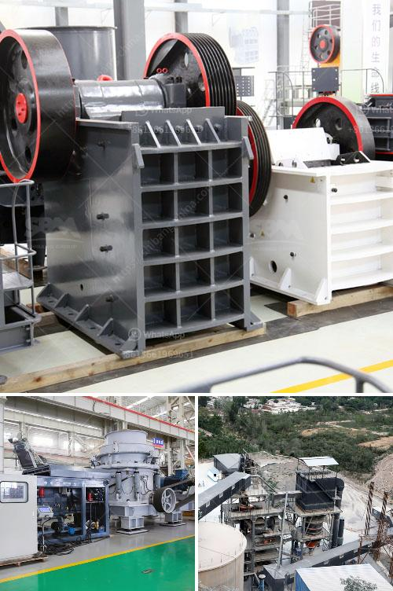

<h3>largest quarry machine manufacturer</h3>
The world's largest quarry machine manufacturer, German-based company Krupp, is being acquired by Finnish company Metso Outotec. The acquisition is expected to be completed by the end of this year, and the combined company will become the largest quarry machine manufacturer in the world.

Krupp has been in the quarry machinery industry for over a century. They are known for their advanced technology and innovative solutions in the field of quarrying. The company's machines are used in various applications, including mining, demolition, construction, and recycling.

With this acquisition, Metso Outotec aims to strengthen its position as a global leader in the quarry industry. The combination of these two companies' expertise will enable them to offer a wide range of products and services to their customers.

The quarry machine market is highly competitive, with many players offering similar products. However, Krupp's reputation for quality and reliability has made them a preferred choice for many quarry operators around the world.

In addition to their machinery, Krupp also provides comprehensive after-sales support and maintenance services. This further enhances their competitiveness in the market and ensures customer satisfaction.

The acquisition of Krupp by Metso Outotec will not only expand their product portfolio but also strengthen their global presence. They will be able to serve customers in more regions and offer localized solutions tailored to specific market needs.

As the largest quarry machine manufacturer, the combined company will have a significant impact on the industry. They will continue to drive innovation and provide efficient and sustainable solutions for quarrying operations worldwide.

In conclusion, the acquisition of Krupp by Metso Outotec will create a formidable player in the quarry machine manufacturing industry. This move will enable them to offer a comprehensive range of products and services and enhance their global presence. With their combined expertise, they will continue to lead the way in innovation and efficiency in the quarrying sector.
<h3>Contact us</h3><ul><li><strong>Whatsapp:&nbsp;<a href="https://wa.me/8613661969651">+8613661969651</a></strong></li><li><a href="https://swt.shibang-china.com/?git&amp;zhl&amp;largest quarry machine manufacturer"><strong>Online Service(chat now)</strong></a></li></ul><h3>Related</h3><ul><li><a href='difference between pebble and stone.md'>difference between pebble and stone</a></li><li><a href='project report on quartz crusher industries.md'>project report on quartz crusher industries</a></li><li><a href='sand making machine application.md'>sand making machine application</a></li><li><a href='how to calculate the cost of returns.md'>how to calculate the cost of returns</a></li><li><a href='used stone crusher in europe for sale.md'>used stone crusher in europe for sale</a></li></ul>