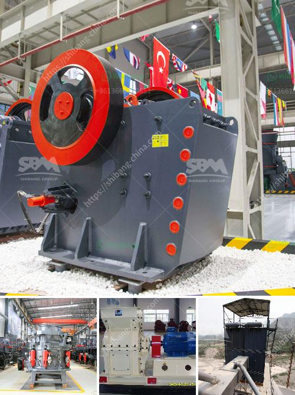

<h3>lates hammer mill</h3>
In today's fast-paced industrial world, technological advancements continue to shape and enhance various industrial processes. The latest innovation making waves in the manufacturing and agricultural sectors is the groundbreaking hammer mill. With its unprecedented features and capabilities, the latest hammer mill is revolutionizing the industry and transforming the way materials are processed.

The latest hammer mill design boasts unparalleled power and efficiency, ensuring optimal performance in various applications. Equipped with a high-speed rotor, it can quickly and effectively pulverize a wide range of materials, from grains and wood chips to agricultural residues and biomass waste.

The advanced control system incorporated into the latest hammer mill enables greater precision and customization options. Operators can effortlessly adjust parameters such as rotor speed, screen size, and airflow, providing the flexibility needed to achieve specific particle sizes and desired final products. This level of control ensures consistent results, excellent product quality, and improved production efficiency.

Versatility is a key feature of the latest hammer mill. Its ability to handle a myriad of materials makes it an indispensable tool across various industries. From the production of animal feeds and biofuels to recycling electronic waste and manufacturing chemicals, the latest hammer mill is a valuable asset for businesses of all sizes.

The latest hammer mill design prioritizes durability and minimizes maintenance requirements. Its robust construction guarantees a long lifespan, even under demanding operating conditions. Additionally, the hammer mill incorporates intelligent systems that automatically detect and minimize machine wear, reducing downtime and maintenance costs significantly.

In an era where environmental sustainability is a growing concern, the latest hammer mill design offers eco-friendly solutions. Its efficient grinding process lowers overall energy consumption, reducing the carbon footprint associated with material processing. Moreover, the hammer mill's ability to convert organic waste into valuable products aligns with the principles of the circular economy, promoting waste reduction and resource optimization.

With its groundbreaking features and capabilities, the latest hammer mill is undoubtedly shaping the future of material processing across multiple industries. As more businesses recognize the potential of this technology, its widespread adoption is expected to drive cost savings, productivity improvements, and increased sustainability throughout the industry.

The emergence of the latest hammer mill signifies a revolution in material processing. Its powerful performance, enhanced control, and multi-functional capability have positioned it as a game-changer in various industries. Offering durability, minimal maintenance, and eco-friendly operation, the latest hammer mill is not just a tool; it represents a step towards more sustainable and efficient manufacturing and agricultural practices. It is an innovation worth embracing for businesses seeking to stay ahead of the curve and drive success in the competitive market.
<h3>Contact us</h3><ul><li><strong>Whatsapp:&nbsp;<a href="https://wa.me/8613661969651">+8613661969651</a></strong></li><li><a href="https://swt.shibang-china.com/?git&amp;zhl&amp;lates hammer mill"><strong>Online Service(chat now)</strong></a></li></ul><h3>Related</h3><ul><li><a href='how much the price of grinder machine in philippines.md'>how much the price of grinder machine in philippines</a></li><li><a href='list of stone crushers in odisha.md'>list of stone crushers in odisha</a></li><li><a href='floating processing mining plants.md'>floating processing mining plants</a></li><li><a href='ballast making machine kenya in kenya.md'>ballast making machine kenya in kenya</a></li><li><a href='mobile crusher for rent in uae.md'>mobile crusher for rent in uae</a></li></ul>