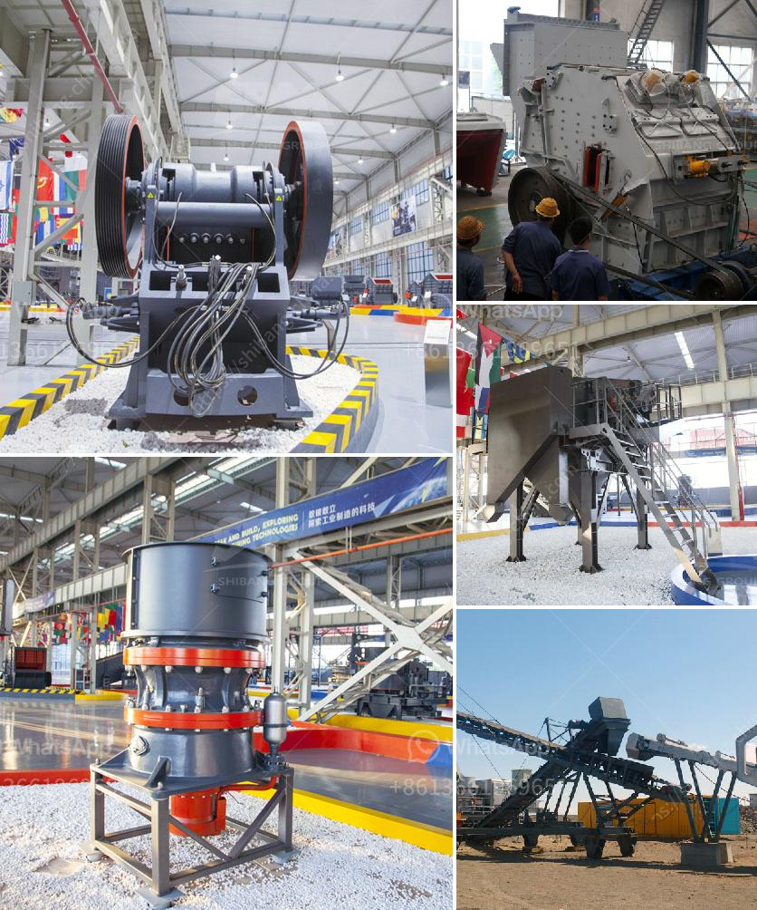

<h3>lime and dolomite plant details</h3>
Lime and dolomite are essential minerals used in agriculture to improve soil health and enhance crop yield. These minerals provide necessary nutrients to the soil, correct soil acidity, and increase the availability of essential elements required for plant growth. Let's delve into the details of lime and dolomite plants and their beneficial effects on agricultural practices.

Lime, often in the form of calcium carbonate, is obtained by heating limestone rocks, while dolomite is formed by the combination of calcium and magnesium carbonates. Both minerals are extensively used in agriculture due to their ability to neutralize soil acidity and release essential minerals like calcium and magnesium. Plants suffering from acidity-related issues, such as nutrient deficiency, slow growth, and overall poor health, can greatly benefit from lime and dolomite treatments.

Lime and dolomite plants employ processes where these minerals are ground into fine particles and spread over the soil. This process is called lime and dolomite application or soil amendment. The particles gradually dissolve in the soil, rectifying pH imbalances by increasing the soil's alkalinity. The neutralization process helps unlock and release vital plant nutrients, improves soil structure, and enhances root growth.

Furthermore, lime and dolomite have proved crucial in preventing toxic accumulations of aluminum and manganese in the soil. These toxic elements are frequently present in acidic soils, hindering optimal plant growth. The application of lime and dolomite not only mitigates these toxicities but also stimulates soil microbial activity, leading to improved nutrient cycling and availability.

The benefits of lime and dolomite plant treatments are numerous. Apart from addressing soil acidity issues, these minerals aid in the development of healthy, robust plants capable of withstanding disease, pest attacks, and environmental stresses. Moreover, enhanced soil structure resulting from lime and dolomite amendment promotes water infiltration and nutrient retention, reducing irrigation needs and fertilizer requirements.

In conclusion, lime and dolomite plants play a crucial role in maintaining soil health and boosting crop productivity. By neutralizing acidic soils and releasing essential nutrients, these minerals provide a fertile environment for plants to thrive. Incorporating lime and dolomite treatments into agricultural practices can lead to substantial benefits, including improved yields, reduced input costs, and sustainable farming practices.
<h3>Contact us</h3><ul><li><strong>Whatsapp:&nbsp;<a href="https://wa.me/8613661969651">+8613661969651</a></strong></li><li><a href="https://swt.shibang-china.com/?git&amp;zhl&amp;lime and dolomite plant details"><strong>Online Service(chat now)</strong></a></li></ul><h3>Related</h3><ul><li><a href='rock crusher plant price.md'>rock crusher plant price</a></li><li><a href='dry ball mill vs wet ball mill.md'>dry ball mill vs wet ball mill</a></li><li><a href='rock grinding mill price in india.md'>rock grinding mill price in india</a></li><li><a href='hydro classifier silica sand.md'>hydro classifier silica sand</a></li><li><a href='feasibility study for the establishment of quarry.md'>feasibility study for the establishment of quarry</a></li></ul>