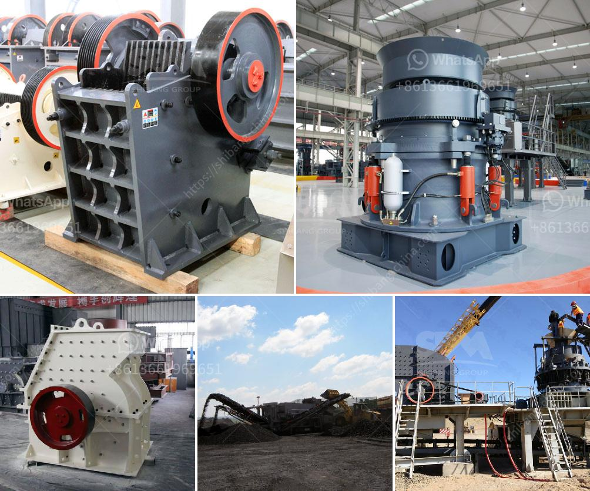

<h3>lime morter grinding machine price list</h3>
In the realm of construction, lime mortar plays a vital role in building sturdy and durable structures. Its unique properties make it a preferred choice for constructing historical monuments, heritage buildings, and even modern residential and commercial buildings. Lime mortar is a blend of lime, sand, and water, which results in a strong and flexible adhesive material.

The process of preparing lime mortar involves grinding lime and sand together to create a fine powder. In order to achieve the desired consistency and texture, specialized grinding machines are utilized. These machines not only ensure efficient and uniform grinding but also facilitate precise mixing of lime and sand.

When it comes to purchasing a lime mortar grinding machine, it is crucial to consider factors such as price, quality, and features. A comprehensive price list assists construction professionals in making informed decisions. Here, we present a brief overview of the price range of lime mortar grinding machines available in the market.

These machines are ideal for small-scale construction projects or for those who have just started with lime mortar preparation. They come with basic features and are priced between $500 and $1,000.

Suitable for medium-sized construction projects, mid-range machines offer enhanced functionality, efficiency, and durability. These machines range from $1,000 to $3,000, providing a balance between price and performance.

Designed for large-scale construction projects or professional contractors, high-end machines provide advanced features, improved grinding precision, and increased productivity. The price for these machines typically starts from $3,000 and can go up to $10,000 or more.

It is important to note that while price is an essential consideration, it should not be the sole determining factor. Quality, durability, and after-sales service should also be taken into account when making a purchase decision.

Investing in a lime mortar grinding machine can greatly enhance the efficiency and precision of construction projects. With the aid of these machines, lime mortar preparation becomes faster, more consistent, and yields higher-quality results. This, in turn, contributes to the overall success and long-lasting quality of buildings.

In conclusion, a well-prepared price list for lime mortar grinding machines aids construction professionals in selecting the most suitable machine for their specific requirements. By considering factors such as price, quality, and features, contractors can make an informed decision that aligns with their budget and project needs. Investing in a high-quality lime mortar grinding machine ultimately leads to improved efficiency and precision, thereby ensuring the durability and strength of constructed structures.
<h3>Contact us</h3><ul><li><strong>Whatsapp:&nbsp;<a href="https://wa.me/8613661969651">+8613661969651</a></strong></li><li><a href="https://swt.shibang-china.com/?git&amp;zhl&amp;lime morter grinding machine price list"><strong>Online Service(chat now)</strong></a></li></ul><h3>Related</h3><ul><li><a href='wet process cement.md'>wet process cement</a></li><li><a href='limestone ore concentration plant.md'>limestone ore concentration plant</a></li><li><a href='brick machine canada suppliers.md'>brick machine canada suppliers</a></li><li><a href='proposal pabrik stone crusher.md'>proposal pabrik stone crusher</a></li><li><a href='usine carbonate de calcium.md'>usine carbonate de calcium</a></li></ul>