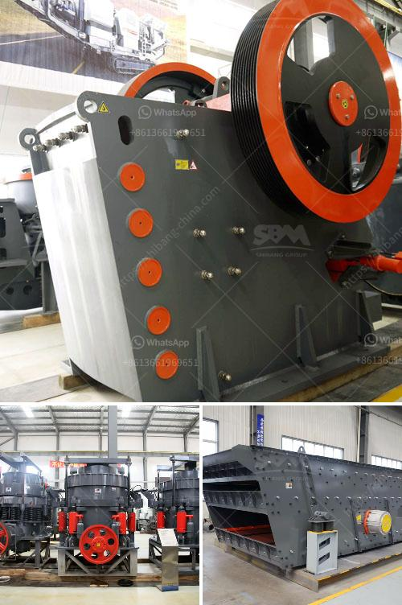

<h3>lime powder making</h3>
Lime powder is a fine substance obtained by grinding limestone, a natural rock that consists mainly of calcium carbonate. This versatile product has various applications in several industries, including construction, agriculture, and manufacturing. Its usefulness stems from its chemical properties, which make it an essential component in various processes and products.

The process of producing lime powder begins with the mining of limestone. Limestone deposits are abundant worldwide and can be found in various forms, ranging from pure white to gray to darker colors due to impurities. Once the limestone is mined, it undergoes a series of steps to transform it into a fine powder.

The first step in the process is crushing the limestone into small pieces. This can be accomplished using heavy machinery, such as crushers or hammer mills, which reduce the size of the rocks. The crushed limestone is then further processed through a series of screens to separate it into different size fractions.

After the initial crushing and screening, the limestone undergoes a process called calcination. Calcination involves heating the limestone to a high temperature, typically around 900-1000 degrees Celsius (1650-1830 degrees Fahrenheit), in a kiln. This process removes carbon dioxide from the limestone, leaving behind calcium oxide, also known as quicklime.

The quicklime is then cooled and ground into a fine powder, which is the lime powder we commonly use. The grinding process can be accomplished using ball mills or other types of grinding equipment. The resulting lime powder has a consistency similar to flour and can vary in color from white to off-white.

Lime powder finds numerous applications in various industries. In the construction industry, it is used in the production of mortar, plaster, and concrete. The addition of lime powder improves the workability, strength, and durability of these materials. Lime-based plasters and mortars also have excellent moisture-regulating properties, making them ideal for use in buildings in humid climates.

Agriculture is another sector that greatly benefits from lime powder. It is commonly used to adjust the pH level of acidic soils, making them more fertile for crops. Lime powder reacts with the soil, neutralizing acidity and providing essential nutrients like calcium and magnesium. Additionally, lime powder can be used as a supplement in animal feeds to ensure proper bone development and overall health.

The manufacturing industry also relies on lime powder for various processes. It is a key ingredient in the production of glass, steel, and paper. Lime powder facilitates the melting of silica in glass production, acts as a flux in steelmaking, and improves the quality and consistency of paper products.

In conclusion, lime powder making involves the transformation of limestone into a versatile product with extensive applications in different industries. The process begins with the mining and crushing of limestone, followed by calcination, cooling, and grinding to obtain the fine powder. Lime powder finds its way into construction, agriculture, and manufacturing sectors, improving the quality and performance of various materials and processes. With its remarkable properties and wide range of uses, lime powder continues to be an indispensable resource in a multitude of industries.
<h3>Contact us</h3><ul><li><strong>Whatsapp:&nbsp;<a href="https://wa.me/8613661969651">+8613661969651</a></strong></li><li><a href="https://swt.shibang-china.com/?git&amp;zhl&amp;lime powder making"><strong>Online Service(chat now)</strong></a></li></ul><h3>Related</h3><ul><li><a href='hammer pulverizer machine price.md'>hammer pulverizer machine price</a></li><li><a href='quarry crusher plant in ethiopia.md'>quarry crusher plant in ethiopia</a></li><li><a href='belt conveyor design free.md'>belt conveyor design free</a></li><li><a href='ball mill drive system.md'>ball mill drive system</a></li><li><a href='cutting milling machine for marble and granite.md'>cutting milling machine for marble and granite</a></li></ul>