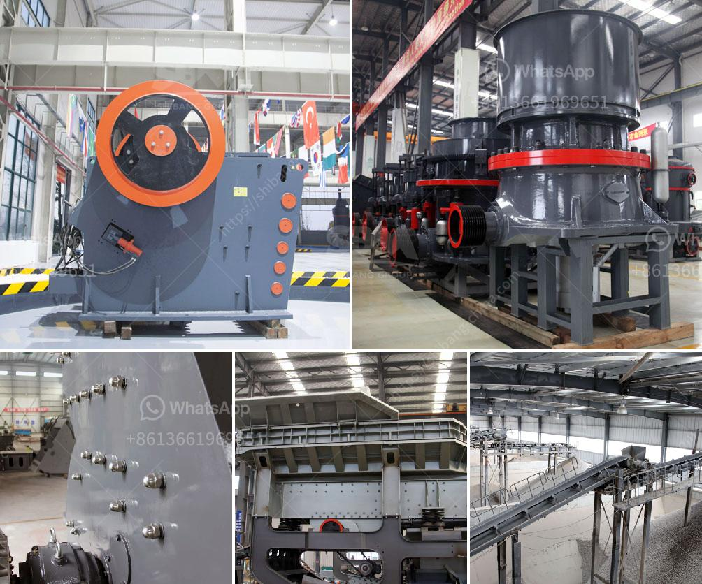

<h3>lime stone screw conveyor</h3>
In the world of industrial automation, material handling plays a crucial role in ensuring seamless and efficient workflow in various industries. One particular equipment that has been widely used in the handling of bulk materials is the limestone screw conveyor. This versatile machine has proven to be an indispensable tool, offering numerous benefits in terms of reliability, efficiency, and flexibility.

At its core, a limestone screw conveyor is essentially a mechanism designed to move bulk materials from one point to another. It consists of a rotating helical screw inside a cylindrical casing, commonly known as a trough. As the screw rotates, it pushes the limestone along the trough, effectively transporting it to its destination.

One of the primary advantages of utilizing a limestone screw conveyor is its tremendous efficiency in handling bulk materials. Limestone, being a heavy and dense material, can be quite challenging to handle manually. However, with the help of a screw conveyor, the process becomes automated, requiring minimal human intervention. The constant and controlled movement of materials ensures a steady flow, significantly reducing potential bottlenecks or supply chain disruptions.

Moreover, the design of a limestone screw conveyor allows for easy customization to fit specific requirements. The length, diameter, and speed of the screw can be adjusted to accommodate different types of materials, ensuring optimal efficiency and minimal wear and tear. This versatility makes the screw conveyor an ideal solution for various industries, including mining, agriculture, construction, and manufacturing.

Another notable advantage of a limestone screw conveyor is its exceptional reliability. The rugged construction of the machine, typically made from durable materials such as stainless steel or carbon steel, ensures longevity and resistance to corrosive agents. This reliability translates into reduced downtime and maintenance costs, allowing businesses to achieve consistent production levels and meet customer demands.

In addition to reliability, the limestone screw conveyor offers a high level of safety. The enclosed design of the trough minimizes the risk of material spillage or dust emissions, which could potentially compromise worker safety or violate environmental regulations. Furthermore, many screw conveyors can be equipped with additional safety features such as emergency stop buttons and overload protection systems, enhancing the overall safety of the operation.

Furthermore, the limestone screw conveyor contributes to improved workplace ergonomics. By automating the material handling process, workers are relieved of physically demanding tasks, reducing the risk of injuries and musculoskeletal disorders. This not only promotes a safer work environment but also enhances employee satisfaction and productivity.

In conclusion, the limestone screw conveyor has proven to be a versatile and reliable solution for material handling needs. Its efficiency, flexibility, and durability make it an essential piece of equipment in various industries. By streamlining the transportation of limestone and other bulk materials, businesses can enhance productivity, reduce downtime, and ensure a safer work environment. As technology continues to advance, it is likely that the limestone screw conveyor will continue to evolve and provide even more efficient and sophisticated material handling solutions.
<h3>Contact us</h3><ul><li><strong>Whatsapp:&nbsp;<a href="https://wa.me/8613661969651">+8613661969651</a></strong></li><li><a href="https://swt.shibang-china.com/?git&amp;zhl&amp;lime stone screw conveyor"><strong>Online Service(chat now)</strong></a></li></ul><h3>Related</h3><ul><li><a href='silica quartz powder processing.md'>silica quartz powder processing</a></li><li><a href='egypt crusher suppliers manufacturers.md'>egypt crusher suppliers manufacturers</a></li><li><a href='price stone crusher dragon.md'>price stone crusher dragon</a></li><li><a href='stone crushing plant manufacturers in.md'>stone crushing plant manufacturers in</a></li><li><a href='mobile concrete crusher.md'>mobile concrete crusher</a></li></ul>