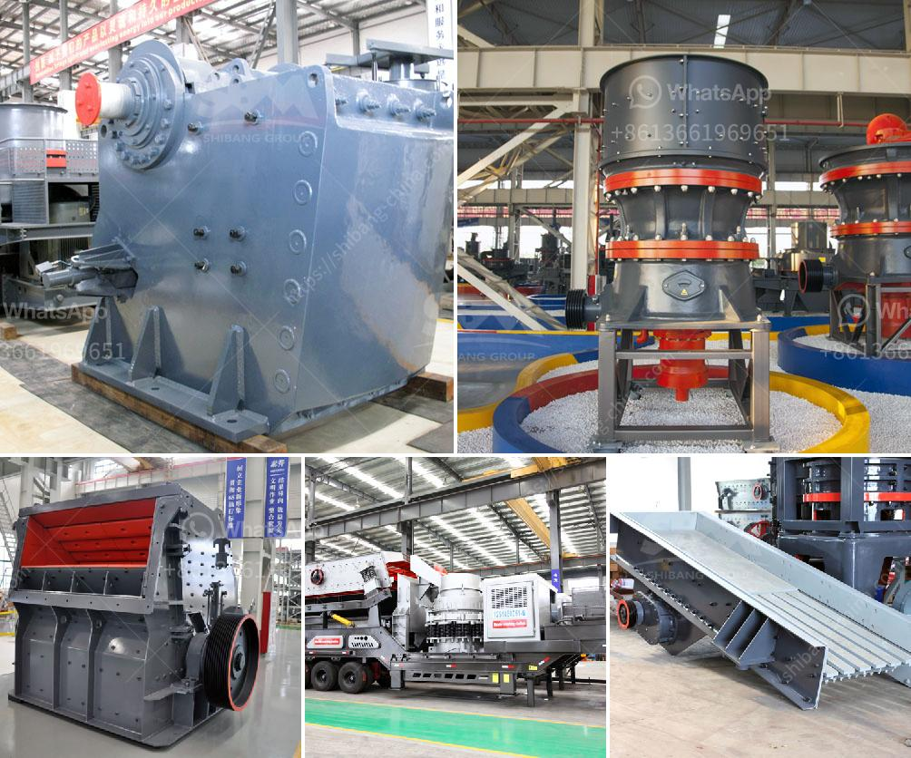

<h3>limestone beneficiation process</h3>
Limestone is a sedimentary rock composed mostly of the mineral calcite and comprising about 15% of the Earth's sedimentary crust. It is a basic building block of the construction industry and a chief material from which aggregate, cement, lime, and building stone are made.

The demand for limestone products is surging due to its widespread use as a raw material in different industries. However, before it can be used effectively, limestone needs to go through a beneficiation process to remove impurities and improve its quality.

The beneficiation process involves various stages of crushing, screening, washing, and separation to produce a high-grade limestone product suitable for use as a raw material for various industries. The techniques used in the beneficiation process include crushing, grinding, washing, magnetic separation, and flotation.

Crushing is the initial stage of comminution, the process of reducing the size of ore materials. Crushing is often accomplished by jaw or gyratory crushers. Primary crushing crushes the large rocks into small particles, and secondary crushing further reduces the particle size.

After crushing, the next stage in beneficiation is grinding. Grinding is the process of pulverizing limestone particles into a fine powder to be applied for various purposes. The proposed limestone grinding mill is Raymond mill, which can grind the material to 80-400 mesh.

The processed limestone powder can be used to produce high-quality calcium carbonate products in different industries such as plastics, rubber, papermaking, and building materials. The limestone powder can also be used in environmental protection, metallurgy, and chemical industries.

During the beneficiation process, the limestone is added to the grinding mill's grinding chamber through the feed chute. The material is then pulverized into a fine powder by the impact and friction forces generated by the rapidly rotating hammers and grinding rollers.

The beneficiation process consists of three sections: crushing, grinding, and screening. Crushing is the initial process of breaking the enormous limestone into smaller pieces. Grinding, on the other hand, transforms limestone particles into a smaller size, and screening separates limestone particles of the required size.

After the crushing and grinding stages, the limestone slurry is processed through a series of separators and pumps to remove any impurities. The purified limestone slurry flows out of the beneficiation process as a fine powder suitable for use in various industries.

The beneficiation process also includes particle size reduction, chemical methods such as flotation, and magnetic separation to remove impurities. These processes can further enhance the quality of the limestone product, making it suitable for specialized applications, such as the production of high-quality cement or lime.

In conclusion, the beneficiation process of limestone is essential for the production of high-quality limestone products and plays a crucial role in sustainable development. It is a complex process that needs careful planning and expertise. By undergoing beneficiation, limestone can be transformed into a versatile raw material used across various industries, contributing to economic growth and environmental sustainability.
<h3>Contact us</h3><ul><li><strong>Whatsapp:&nbsp;<a href="https://wa.me/8613661969651">+8613661969651</a></strong></li><li><a href="https://swt.shibang-china.com/?git&amp;zhl&amp;limestone beneficiation process"><strong>Online Service(chat now)</strong></a></li></ul><h3>Related</h3><ul><li><a href='raymond mills mumbai.md'>raymond mills mumbai</a></li><li><a href='equipments used in cement industry.md'>equipments used in cement industry</a></li><li><a href='marble crushing machinery.md'>marble crushing machinery</a></li><li><a href='crushed plant mobile coquimbo.md'>crushed plant mobile coquimbo</a></li><li><a href='stone crushing plant manufacturers in.md'>stone crushing plant manufacturers in</a></li></ul>