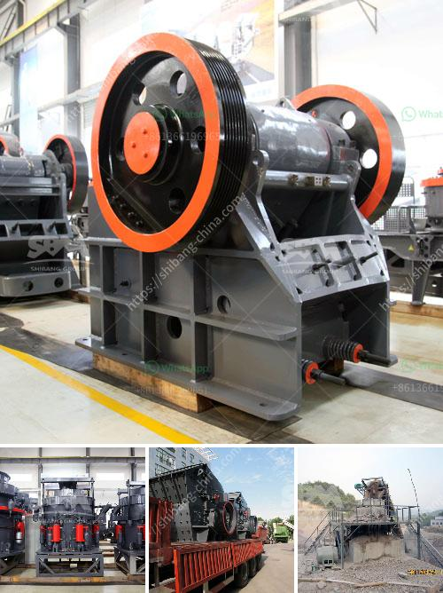

<h3>limestone crusher for sale</h3>
Limestone is a sedimentary rock composed mainly of calcium carbonate (CaCO3), usually in the form of calcite or aragonite. It is an essential and common substance found in rocks all over the world. Limestone is widely used as a construction material and industrial raw material, especially in cement manufacturing. It is a crucial and versatile resource.

To obtain limestone, it is usually mined from quarry deposits and then crushed to different sizes. The size and quality of the crushed limestone can vary depending on the intended use. There are several types of limestone crushers that can be used in limestone crushing plants. The jaw crusher, impact crusher, cone crusher, and gyratory crusher are commonly used for primary crushing.

In mining and aggregate production industries, the jaw crusher is widely used. It works by squeezing the material between a moving plate (jaw) and a stationary plate. The jaw crusher can handle large rocks and crush them to a smaller size required for subsequent crushing stages. With its high efficiency and low cost, the jaw crusher is highly favored for limestone crushing plants.

Another popular type of limestone crusher is the impact crusher. It works by giving a blow to the material that is inserted into the machine. The impact crusher can crush the limestone to a smaller size compared to the jaw crusher, thus offering a greater reduction ratio with a lower energy consumption.

Cone crushers are another compression crushing technology. They are often used for secondary or tertiary crushing stages. Cone crushers have a conical shape and a smaller eccentric, providing a finer crushing gap. They are commonly used for crushing hard and abrasive materials in limestone processing.

The gyratory crusher is often used as either primary or secondary crusher in many mining operations as it delivers sufficient force to crush large ore bearing rocks. 3. Cone crusher. The cone crusher is the most widely used crusher in mining operation across the world. The crusher is designed in a similar fashion as the gyratory crusher but the crushing chamber is less steep with the sides near parallel.

The limestone crusher plant powered by JXSC Machine Factory has been put into production in Canada, this production line has an output of over 500 tons per hour. General Information of Limestone Crusher Plant 1.Main equipment as follows: Jaw crusher, impact rock crusher, vibratory feeder, single-cylinder cone crushers, vibratory screen.

Limestone crusher plant is kind of special stone processing line for crushing hard mineral. To meet the production requirements, it can take coarse or fine crush for the limestone to produce stones of all sizes. This is beneficial to the deep processing of limestone in the later stage.

Limestone coarse crusher: jaw crusher. The limestone jaw crusher is usually used as the first rock crusher, and it is suited for medium-size crushing of ore and bulk materials with a compressive strength of not more than 320Mpa. Jaw crusher is divided into coarse crushing and fine crushing. The feeding size is 125mm~750mm.

The limestone crusher machine is a equipment which can crush materials about 600-1800mm into materials about 25mm or smaller. It can crush various kinds of medium hardness materials such as: limestone, slag, coke, coal and other materials.

In the limestone production line with the capacity of 100t/h, 150t/h, and 200t/h, the common limestone crushing production line can be configured as follows:

Vibrating feeder + primary Jaw crusher + impact crusher + vibrating screen + belt conveying system + control system

In the above limestone crushing production line, the main machines used are vibrating feeder, jaw crusher, impact crusher, vibrating screen, belt conveyor and control system, etc.

With the rapid development of limestone processing industry, it needs more and more high quality and advanced limestone quarry plant machine. SBM has produced the mobile limestone cone crusher for the growing needs. SBM mobile limestone cone crusher combines high mobility with high productivity and great flexibility. They can be linked together variously to produce a range of fractions. With a high level of automation and excellent interlocking characteristics, one or more units can be controlled by a single operator.

Limestone crusher for sale is just one of many valuable uses of limestone. With the wide application of limestone, limestone mining industry has developed rapidly in recent years. Limestone crusher is a key crushing equipment to crush limestone. Therefore, limestone mining and crushing industry has broad prospects. Every year, Fote exports a lot of jaw crushers for limestone to the Philippines.

The limestone jaw crusher is one of the indispensable crushing equipment in the limestone crushing production line. The equipment is mainly used for primary rough crushing processing of large limestone. The structure of the device is simple and reasonable, and it adopts a deep V-crushing cavity type, and the work is reliable. The crushed limestone particle size is generally 20-40mm, and the finished product particle size is generally 0-10mm.

In conclusion, limestone crushers are also necessary equipment in limestone crushing production line for its professional crushing technology and strong crushing effect. Therefore, it is necessary to choose the right limestone crusher and limestone crushing production line based on the characteristics of limestone to help users get the ideal return on investment.
<h3>Contact us</h3><ul><li><strong>Whatsapp:&nbsp;<a href="https://wa.me/8613661969651">+8613661969651</a></strong></li><li><a href="https://swt.shibang-china.com/?git&amp;zhl&amp;limestone crusher for sale"><strong>Online Service(chat now)</strong></a></li></ul><h3>Related</h3><ul><li><a href='graphite powder making machine.md'>graphite powder making machine</a></li><li><a href='jaw crushers south africa.md'>jaw crushers south africa</a></li><li><a href='tph mobile crushing plant.md'>tph mobile crushing plant</a></li><li><a href='price for mobile stone crushers in japan.md'>price for mobile stone crushers in japan</a></li><li><a href='prices on cone crusher parts.md'>prices on cone crusher parts</a></li></ul>