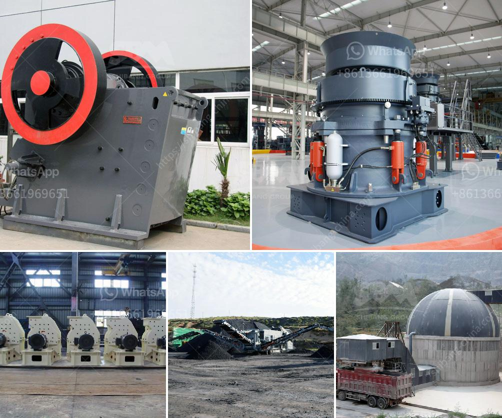

<h3>limestone crusher machine limus</h3>
Limestone is a sedimentary rock composed largely of calcite, calcium carbonate (CaCO3). Limestone often contains variable amounts of silica or siliceous skeletal fragment, as well as varying amounts of clay, silt and sand. Limestone rocks are used for construction materials, as well as raw materials for cement production. The limestone is vital for industries like construction, agriculture, and manufacturing. However, to utilize these resources, people have to mine and process them.

One efficient way to extract and process limestone is to use a limestone crusher machine. Limus is a machine designed for crushing limestone, making it suitable for manufacturing cement and sand. It is equipped with a hydraulic system, which saves time and effort by enabling the machine to open easily and quickly for maintenance and repair.

The limus limestone crusher machine operates using a stationary jaw and movable jaw generated by electricity or hydraulic energy. The jaws are designed to crush the limestone into smaller pieces, helping to produce even-sized particles for various applications. Additionally, the machine features a vibrating feeder that helps feed the limestone into the crusher evenly and continuously. This ensures a smooth and efficient crushing process.

One of the main advantages of the limus limestone crusher machine is its high crushing ratio. The machine is capable of reducing large rocks or limestone into smaller, more manageable sizes. This makes it easier to transport and use in different applications. The crusher also features a high capacity, allowing for efficient processing of large quantities of limestone.

Furthermore, the machine is built with durability in mind. The materials used in the construction of the limus limestone crusher machine are of high quality, ensuring long-lasting performance. The machine is designed to withstand heavy use and tough operating conditions.

The limus limestone crusher machine is also equipped with several safety features. These features ensure the safety of the operators during the crushing process. For example, the machine has a protective guard around the crushing chamber to prevent any accidents. It also features an auto-protective system that stops the machine if there is any overload or malfunction.

In addition to its efficiency and safety features, the limus limestone crusher machine is also environmentally friendly. The machine has low noise levels, minimizing disturbance to the surrounding environment. It also produces low emissions, reducing its impact on air quality.

In conclusion, the limus limestone crusher machine is a highly efficient and reliable tool for crushing limestone. Its high crushing ratio, capacity, durability, and safety features make it suitable for a variety of applications in the construction, agriculture, and manufacturing industries. Moreover, its environmental friendliness further highlights its suitability for sustainable and responsible use. With the limus limestone crusher machine, companies can extract and process limestone more efficiently and effectively, contributing to the growth and development of various industries.
<h3>Contact us</h3><ul><li><strong>Whatsapp:&nbsp;<a href="https://wa.me/8613661969651">+8613661969651</a></strong></li><li><a href="https://swt.shibang-china.com/?git&amp;zhl&amp;limestone crusher machine limus"><strong>Online Service(chat now)</strong></a></li></ul><h3>Related</h3><ul><li><a href='barium powder production machine.md'>barium powder production machine</a></li><li><a href='business plan for a quarry.md'>business plan for a quarry</a></li><li><a href='small scale mining equipment in nigeria.md'>small scale mining equipment in nigeria</a></li><li><a href='clay crusher machine in india.md'>clay crusher machine in india</a></li><li><a href='gold mining equipment for sale in singapore.md'>gold mining equipment for sale in singapore</a></li></ul>