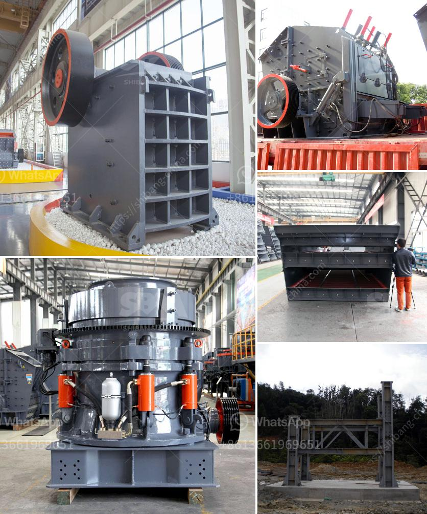

<h3>limestone crusher manufacturers price</h3>
Limestone plays a very important role in the national economic development. With the acceleration of infrastructure construction, the industrialization process in various regions is constantly accelerating, and the demand for limestone is gradually increasing. As an important building material, limestone is widely used in highways, railway construction, cement, and metallurgical industries. With the gradual increase in market demand, the competition among limestone crusher manufacturers is becoming more and more fierce.

When purchasing equipment, users are more concerned about the price of equipment. However, the price of limestone crusher is not the only factor affecting the overall cost of the crusher. The quality and performance of the equipment will also affect the price of the equipment, so the price of the equipment is generally combined with the specific conditions of the user when purchasing the equipment.

The price of limestone crushers sold in different regions will be different because the manufacturers have different sales models. The rock crusher manufacturer's energy consumption is large, about 95% of the total power consumption of the machine is used for crushing, therefore, choosing a suitable crushing machine with high energy utilization rate should be selected first.

This machine adopts the mechanical energy transfer crushing method to reduce the power consumption of the equipment. This method of reducing the power consumption is one of the main ways to solve the energy saving and environmental protection problems of the crusher. The price of the hammer crusher varies with models, manufacturing technology and spare parts. With 40 years of experience, Fote Machinery has been in line with market demands and improved product quality and technology for many times, thus, our hammer crusher has the advantages of low energy consumption and high automaticity.

And the company's crusher is available in a variety of models to meet different customer requirements. For limestone crusher manufacturers, the main factors affecting the price are: the consumption model, technology (equipment quality), and manufacturers. So different models have different prices, and there are even the same manufacturers, the same models of different prices.

The price of the equipment is directly related to the demand of users in the market. The first is the technical performance of the equipment, which directly affects the price of the equipment. The technical performance of the equipment is based on the requirements of the users for the equipment, and the demand of the market is greater, which leads to the higher price of the equipment.

In addition, the price of the equipment is also related to the model of the equipment, because the model of different manufacturers will be different, so the price of different models of equipment will be different, and the equipment that meets the needs of users is also the one that suits users, so the price is different.

In summary, the price of limestone crusher will not only be affected by the factors of equipment and manufacturers, but also influenced by market demand. In recent years, the demand for limestone has surged, which brings a huge business opportunity for limestone crusher manufacturers. The price of limestone crushers is directly related to their sizes, models, and how they are marketed. Consequently, there is great difference among the price of limestone crusher in multiple regions.       
<h3>Contact us</h3><ul><li><strong>Whatsapp:&nbsp;<a href="https://wa.me/8613661969651">+8613661969651</a></strong></li><li><a href="https://swt.shibang-china.com/?git&amp;zhl&amp;limestone crusher manufacturers price"><strong>Online Service(chat now)</strong></a></li></ul><h3>Related</h3><ul><li><a href='raymond mill manufacturers in india.md'>raymond mill manufacturers in india</a></li><li><a href='material using for making talcum powder.md'>material using for making talcum powder</a></li><li><a href='gold processing plant equipment price.md'>gold processing plant equipment price</a></li><li><a href='manganese wash plant zambia.md'>manganese wash plant zambia</a></li><li><a href='stone crusher portable.md'>stone crusher portable</a></li></ul>