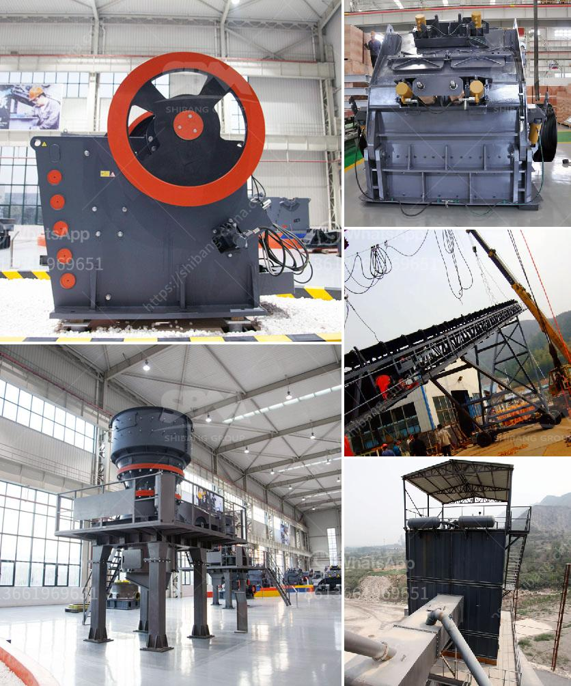

<h3>limestone crusher screening types plant</h3>
Limestone is one of the most commonly used natural stones across the globe. It has a wide range of applications, including construction, agriculture, landscaping, and even industrial purposes. In order to meet the demands for high-quality limestone in these industries, it is essential to have an efficient crushing and screening plant.

Limestone crusher and screening plant aim to provide the most effective solution for crushing and screening applications in various industries. The stationary limestone crushing plant is designed for high capacities and long-lasting service life. Its mobility and flexibility make it ideal for tertiary crushing and screening in a multi-stage crushing process.

There are several types of crushers that can be used to achieve the desired particle size, including jaw crushers, impact crushers, and cone crushers. These crushers operate by applying compressive force to the material, eventually breaking it down into smaller pieces. However, the selection of the crusher depends on the type, size, and hardness of the limestone to be processed.

Once the limestone is crushed, it is then screened to achieve desired particle sizes. Screening is the separation of material into different sized products. The use of screens ensures that the limestone is properly classified into specified sizes during the crushing process. Vibrating screens are commonly used for this purpose since they can efficiently separate the limestone into different fractions.

There are various types of screening equipment available for limestone plants, including inclined screens, horizontal screens, and multi-frequency screens. Inclined screens are the most common type and are widely used in mining and quarrying operations. They are effective at separating larger particles from smaller ones. On the other hand, horizontal screens are beneficial for applications where precise particle sizing is required.

Another innovative technology used in limestone screening is the multi-frequency screen. This type of screen is designed to eliminate screen blinding and generate higher production capacities. It utilizes the principle of high-frequency vibrations to bring more fines to the undersize fraction, resulting in improved sizing accuracy.

In addition to crushing and screening, a limestone plant may also incorporate a washing plant to remove impurities and enhance the quality of the final product. The washing process involves immersing the crushed limestone in water to remove the fines and unwanted materials. This is particularly useful for limestone used in construction, as it ensures the final product meets the desired specifications.

In conclusion, limestone crusher and screening plants are essential for the efficient processing of limestone into various products. The crushing process alone can account for several stages, depending on the desired outcome. Additionally, various types of screens are used to classify the limestone into different sizes before it is used in various industries. With the right combination of crushing and screening equipment, a limestone plant can deliver high-quality materials that meet the requirements of a wide range of applications.
<h3>Contact us</h3><ul><li><strong>Whatsapp:&nbsp;<a href="https://wa.me/8613661969651">+8613661969651</a></strong></li><li><a href="https://swt.shibang-china.com/?git&amp;zhl&amp;limestone crusher screening types plant"><strong>Online Service(chat now)</strong></a></li></ul><h3>Related</h3><ul><li><a href='crusher plant in pakistan.md'>crusher plant in pakistan</a></li><li><a href='production process of cement.md'>production process of cement</a></li><li><a href='circuit stone cone crusher plant.md'>circuit stone cone crusher plant</a></li><li><a href='safety of belt conveyors in hindi.md'>safety of belt conveyors in hindi</a></li><li><a href='price of crusher.md'>price of crusher</a></li></ul>