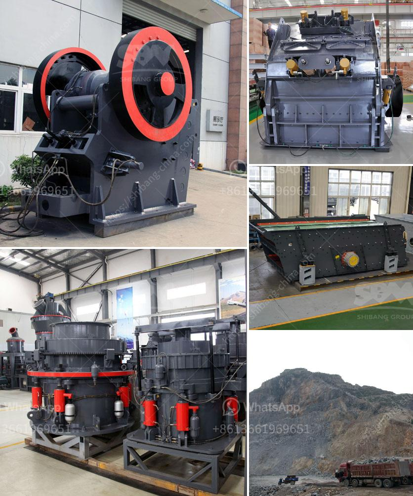

<h3>limestone grinding mill german for sale</h3>
Limestone is a sedimentary rock formed predominantly of calcium carbonate deposits, making it an essential ingredient for various industrial applications. One of the primary uses of limestone is in the construction industry, where it is utilized as a base material for roads, buildings, and even as a component in cement production.

To cater to the growing demand for limestone, grinding mills have become an integral part of many industries that rely on this mineral. These mills are specialized machines used to grind limestone into a fine powder, enabling its easy use and transportation. There are numerous types of limestone grinding mills available in the market, each with its own set of features and specifications.

Among the many options available, German-made limestone grinding mills have gained immense popularity due to their exceptional performance and durability. German engineering has long been renowned for its precision and reliability, and this expertise transfers seamlessly to the production of grinding mills. These mills are designed to process limestone efficiently and effectively, producing consistent results in terms of particle size and quality of the end product.

One of the key advantages of limestone grinding mills German for sale is their advanced technology. German manufacturers are constantly in the pursuit of developing cutting-edge machinery that incorporates automation and intelligent systems. This ensures that the grinding process is streamlined, reducing manual intervention and minimizing the chances of equipment breakdown.

Additionally, German limestone grinding mills are built to last. The robust construction and the use of high-quality materials make these mills highly durable, able to withstand the rigors of continuous operation. This longevity translates to reduced maintenance costs and higher productivity for businesses that rely on these mills for their limestone processing needs.

Finally, German limestone grinding mills are known for their eco-friendly operations. These mills are designed to minimize energy consumption while maximizing the efficiency of the grinding process. This not only reduces the carbon footprint but also contributes to cost savings for industries that utilize these mills on a large scale.

In conclusion, German limestone grinding mills for sale offer a reliable and efficient solution for businesses in need of limestone processing machinery. From their advanced technology and durable construction to their eco-friendly operations, these mills are a valuable investment for industries that rely on limestone as a fundamental material. By opting for German-made grinding mills, businesses can ensure optimal performance, reduced maintenance costs, and contribute towards sustainable development.
<h3>Contact us</h3><ul><li><strong>Whatsapp:&nbsp;<a href="https://wa.me/8613661969651">+8613661969651</a></strong></li><li><a href="https://swt.shibang-china.com/?git&amp;zhl&amp;limestone grinding mill german for sale"><strong>Online Service(chat now)</strong></a></li></ul><h3>Related</h3><ul><li><a href='small crushers for sale.md'>small crushers for sale</a></li><li><a href='powder ball milling machines.md'>powder ball milling machines</a></li><li><a href='two pass roller mill.md'>two pass roller mill</a></li><li><a href='jaw crusher in dubai.md'>jaw crusher in dubai</a></li><li><a href='clay crusher machine in india.md'>clay crusher machine in india</a></li></ul>