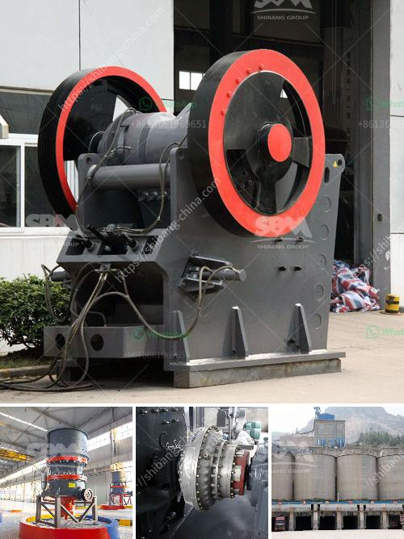

<h3>limestone impact crusher wobbler</h3>
Limestone is one of the most widely used raw materials in the construction and manufacturing industries. It is a sedimentary rock formed by the accumulation of shell, coral, and other organic remains. Limestone is known for its durability and versatility, but extracting and processing it can have negative environmental impacts. To mitigate these impacts, the use of innovative equipment like the limestone impact crusher wobbler has become increasingly popular.

The limestone impact crusher wobbler is a heavy-duty piece of equipment that breaks down the limestone by rotating it into uneven chunks. This generates an impactful pulsating effect that creates friction and pressure, resulting in the further reduction of materials. By utilizing this unique technology, the limestone impact crusher wobbler offers numerous advantages over traditional crushers.

One of the primary advantages of the limestone impact crusher wobbler is its exceptional efficiency. With its pulsating action, it effectively breaks down limestone into smaller sizes, reducing the need for secondary crushing, which often leads to a loss of material and energy. This ensures that the limestone is processed more efficiently, saving time, resources, and money for developers, manufacturers, and builders.

Furthermore, the limestone impact crusher wobbler has a larger feed size capacity compared to standard crushers. It can process chunks of limestone up to 3 meters in diameter, allowing for a more significant amount of material to be processed at once. This not only improves productivity but also reduces the need for multiple crushing stages, resulting in less energy consumption and lower emissions.

In terms of environmental impact, the limestone impact crusher wobbler offers several advantages as well. First and foremost, it reduces the reliance on traditional blasting methods, which can contribute to noise pollution, air pollution, and health hazards for nearby communities. By using the limestone impact crusher wobbler, developers can significantly reduce the negative impact on the environment and the surrounding communities.

Additionally, the limestone impact crusher wobbler's design also minimizes dust emissions. Dust is a common issue in mining and quarrying operations, and excessive dust can harm workers' health as well as pollute the air and nearby water sources. The unique design of the limestone impact crusher wobbler ensures that the pulverized limestone is contained within the crusher, reducing dust emissions and promoting a cleaner working environment.

Another crucial environmental benefit of the limestone impact crusher wobbler is its portability. Traditional crushers are often stationary and require considerable infrastructure for installation. The limestone impact crusher wobbler, on the other hand, is easily transportable and can be installed in various locations, reducing the need for additional infrastructure and minimizing environmental disturbance.

In conclusion, the limestone impact crusher wobbler is a game-changer in the field of limestone processing. Its innovative design and pulsating action not only improve efficiency but also reduce environmental impact. With its ability to process larger chunks of limestone and minimize dust emissions, the limestone impact crusher wobbler offers a more sustainable and responsible solution for the construction and manufacturing industries. By embracing this advanced technology, we can continue to enjoy the benefits of limestone while minimizing its negative impacts on the environment.
<h3>Contact us</h3><ul><li><strong>Whatsapp:&nbsp;<a href="https://wa.me/8613661969651">+8613661969651</a></strong></li><li><a href="https://swt.shibang-china.com/?git&amp;zhl&amp;limestone impact crusher wobbler"><strong>Online Service(chat now)</strong></a></li></ul><h3>Related</h3><ul><li><a href='lime powder making.md'>lime powder making</a></li><li><a href='mobile concrete crusher uk prices.md'>mobile concrete crusher uk prices</a></li><li><a href='used ultra fine wet grinding mill gold ore.md'>used ultra fine wet grinding mill gold ore</a></li><li><a href='used 500 tph stone crusher prices.md'>used 500 tph stone crusher prices</a></li><li><a href='manganese wash plant zambia.md'>manganese wash plant zambia</a></li></ul>