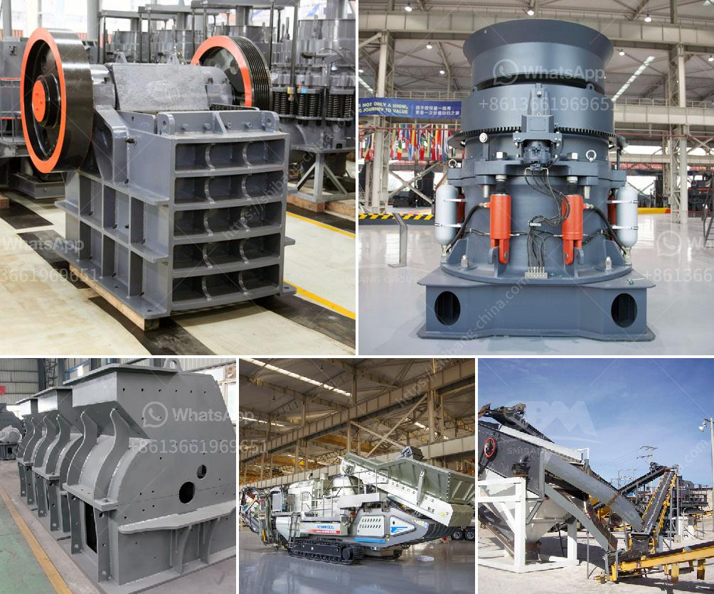

<h3>limestone jaw crusher for sale</h3>
Limestone jaw crusher is the widely used primary limestone crusher machine. It is mainly used in coarse limestone crushing process. Fixed jaw plate, and movable jaw plate are wearable parts. Fote limestone jaw crusher can work continuously for 720 hours without stopping. The machine can handle various types of limestone materials with the feeding size less than 960mm, and the discharging size is adjustable from 40mm-90mm. Due to its reliable performance and competitive price, Fote jaw crushers have been exported to more than 100 countries over the past 30 years.

As a type of rock crusher, jaw crusher has some specific features and benefits. The advantage of jaw crusher is reasonable matching, unobstructed discharge all line, reliable working, convenient operation, high efficiency and saving energy. The jaw crusher can extend with the raw material places or the construction site because of its good mobility. In order to serve different product requirements, the jaw crusher can make multiple matching. The jaw plate is the main wearing part in jaw crusher, which is composed of movable jaw plate and fixed jaw plate. The jaw plate is made of ultrahigh manganese steel, with the characteristics of good rigidity, good toughness and good wear resistance.

The working principle of jaw crusher is very simple. The whole crushing process rely on the relative motion of the two jaw plates. One of the jaw plates stay still while the other move against it. And with the movement, the materials between the two plates would be crushed into small elements. The jaw crusher is capable to crush mineral ores, rocks, and slag with crush strength less than 280Mpa. And size of materials fed in the stone jaw crusher should be equal or smaller than the maximum feeding size described in the following technical data.

Jaw crusher machine is suitable for mines, building materials, highway, railway, water conservancy and chemical industry, etc. The crushing strength of jaw crusher machine is as much as 320 Mpa. The discharging size of finished products is uniform and the adjustability is excellent. The device is especially suitable for the construction of large-scale aggregate production lines and is fully applicable to medium-sized mines. The limestone jaw crusher for sale is assembled with high-quality bearings, such as the FAG bearing, which greatly reduces the impact on the machine. High crushing ratio and production efficiency.

Connection of higher turning speed and stroke makes rated power and passing capacity improved greatly and crushing ratio and capacity increased. New cambered jaw increases the effective length of the jaw plate and brings lager capacity. The motor transmits power through belt, drives the moving jaw to do periodic motion towards the fixed jaw by the eccentric shaft. The angle between toggle plate and moving jaw plate increases when moving jaw moves. So the moving jaw moves towards the fixed jaw. The stuff will be crushed in this process. The angle between toggle plate and moving jaw decreases when moving jaw moves down, the moving jaw moves leaves fixed jaw by pulling rod and spring, the final crushed stuff will be discharged from the outlet. The moving jaw of the crusher makes periodic crushing and discharging along with the motor to realized batch production.

In order to prevent the damage of the bearing caused by wrong operation, we recommend that the operator should pay attention to the operation, maintenance and repair of the jaw crusher. We recommended to buy impact crusher machine, otherwise, you'd better buy from an official manufacturer with reliable quality assurance. The maintenance of jaw crusher machine is very important to the production enterprise, so we remind you that in the selection of the crusher, the machine width more than two palms is the best choice. It is also the inspection basis for buying machines online or offline.
<h3>Contact us</h3><ul><li><strong>Whatsapp:&nbsp;<a href="https://wa.me/8613661969651">+8613661969651</a></strong></li><li><a href="https://swt.shibang-china.com/?git&amp;zhl&amp;limestone jaw crusher for sale"><strong>Online Service(chat now)</strong></a></li></ul><h3>Related</h3><ul><li><a href='small scale mining equipment in nigeria.md'>small scale mining equipment in nigeria</a></li><li><a href='ballast crushing machine kenya.md'>ballast crushing machine kenya</a></li><li><a href='stone crushers price in south.md'>stone crushers price in south</a></li><li><a href='wet process cement.md'>wet process cement</a></li><li><a href='tons stationary impact granite crusher.md'>tons stationary impact granite crusher</a></li></ul>