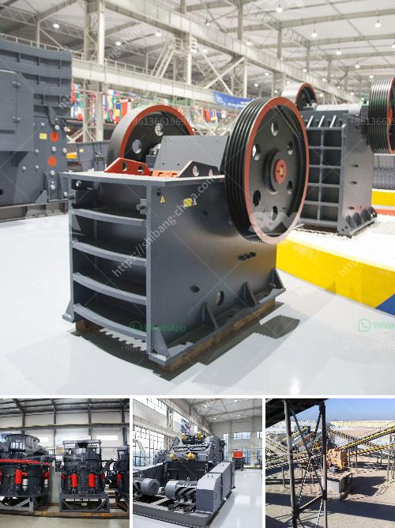

<h3>limestone mobile crusher supplier in malaysia</h3>
Limestone is the natural stone that is formed mainly from calcium carbonate minerals. Limestone deposits are abundant in Malaysia and are found primarily in the northern parts of the country. It is a versatile stone with various uses, including as building material, as a raw material in the production of cement, and as an aggregate for road construction.

In recent years, the demand for limestone in Malaysia has been increasing due to its numerous applications. As a result, the need for mobile crushers to extract limestone from the quarries and process it into usable products has become crucial. Mobile crushers are widely used in the mining industry for their ease of mobility, rugged construction, and ability to process a wide range of materials.

When it comes to limestone mobile crushers in Malaysia, the leading supplier is undoubtedly SBM. With over 20 years of experience in the industry, SBM provides the world-class crushing and grinding equipment for the quarrying, mining, and recycling industries. They offer a comprehensive range of mobile crushers and screens, which include jaw crushers, impact crushers, cone crushers, and screens for efficient and precise material processing.

One of the advantages of choosing SBM as your limestone mobile crusher supplier in Malaysia is their extensive after-sales support. They have a team of experienced engineers and technicians who can provide on-site installation, troubleshooting, and maintenance services to keep your equipment operating at peak efficiency.

Furthermore, SBM's mobile crushers are equipped with advanced technology, such as high-performance engines, hydraulic systems, and intelligent control systems. This ensures reliable operation, reduced downtime, and increased productivity. Additionally, their mobile crushers are designed for easy transportation and quick set-up, allowing you to move them from one site to another as needed.

In conclusion, if you are in the market for a limestone mobile crusher in Malaysia, SBM is the best choice. With their high-quality equipment, extensive after-sales support, and advanced technology, SBM can help you meet your limestone processing needs efficiently and effectively.
<h3>Contact us</h3><ul><li><strong>Whatsapp:&nbsp;<a href="https://wa.me/8613661969651">+8613661969651</a></strong></li><li><a href="https://swt.shibang-china.com/?git&amp;zhl&amp;limestone mobile crusher supplier in malaysia"><strong>Online Service(chat now)</strong></a></li></ul><h3>Related</h3><ul><li><a href='bauxite processing into aluminum.md'>bauxite processing into aluminum</a></li><li><a href='small scale tantalum milling machine supplier.md'>small scale tantalum milling machine supplier</a></li><li><a href='sand maker machines.md'>sand maker machines</a></li><li><a href='crusher stone crusher 4 ton.md'>crusher stone crusher 4 ton</a></li><li><a href='precipitated calcium carbonate process.md'>precipitated calcium carbonate process</a></li></ul>