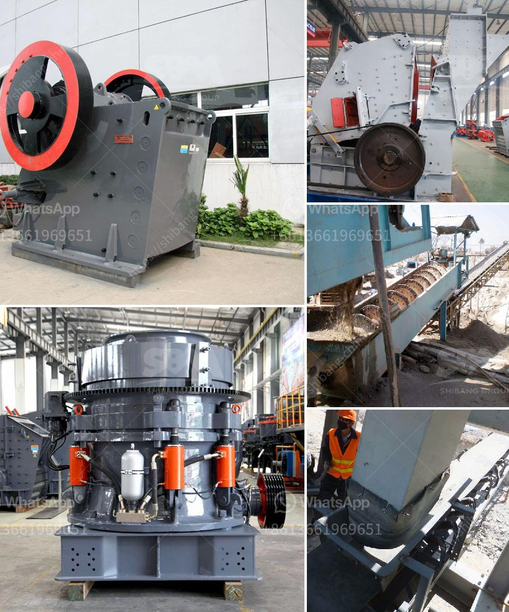

<h3>limestone mobile crushing plant</h3>
Limestone is a sedimentary rock composed mainly of calcium carbonate (CaCO3), usually in the form of calcite or aragonite. It is commonly used as a building material and a raw material for many industrial uses, such as cement, additives in paper and paint, and even as a soil conditioner. With the increasing demand for limestone products, it is necessary to have efficient and mobile crushing plants that can process limestone quickly and effectively.

A limestone mobile crushing plant is a moving production line that is specially designed for the needs of crushing limestone. It is relatively easy to transport and can move on-site or be transferred to a nearby production site. The mobile crushing plant can also be used in conjunction with various screens to form a closed-loop system to achieve higher discharge specifications.

The limestone mobile crushing plant mainly includes mobile jaw crusher, mobile impact crusher and mobile cone crusher. In the first stage, coarse crushing, the limestone materials are evenly sent to the jaw crusher by the vibrating feeder for primary crushing. After the coarse crushed materials are screened by the vibrating screen, they are transported to the impact crusher or cone crusher for fine crushing through the belt conveyor.

In the second stage, fine crushing, the limestone materials with the appropriate particle size are sent to the vibrating screen for further screening. The materials that meet the particle size requirements are sent to the finished product pile by the belt conveyor, while the materials that do not meet the requirements are returned to the impact crusher or cone crusher for crushing again.

The limestone mobile crushing plant has various configurations, with different equipment combinations and production capacities. It can be customized according to specific needs and requirements. For example, a 100-150t/h limestone mobile crushing plant can be configured as follows: vibrating feeder + jaw crusher + impact crusher + vibrating screen. This configuration is suitable for processing limestone with a feed size of less than 500mm and a compressive strength of less than 320MPa.

The advantages of a limestone mobile crushing plant are numerous. Firstly, it significantly reduces the transportation costs for delivering limestone from the quarry to the processing plant. Secondly, it allows for flexible operation and improved efficiency, as it can be moved to different locations based on the availability of limestone deposits. Moreover, the mobile crushing plant is also environmentally friendly, as it produces less dust and noise during operation compared to traditional crushing plants.

In conclusion, a limestone mobile crushing plant offers a cost-effective and efficient solution for crushing limestone materials. It is an ideal choice for limestone quarries or sites where it is difficult to transport limestone materials to a stationary crushing plant. With the flexibility and mobility provided by a mobile crushing plant, limestone can be processed on-site quickly and effectively, meeting the increasing demand for limestone products in various industries.
<h3>Contact us</h3><ul><li><strong>Whatsapp:&nbsp;<a href="https://wa.me/8613661969651">+8613661969651</a></strong></li><li><a href="https://swt.shibang-china.com/?git&amp;zhl&amp;limestone mobile crushing plant"><strong>Online Service(chat now)</strong></a></li></ul><h3>Related</h3><ul><li><a href='vibrating screen for mesh 14 vibrating screen.md'>vibrating screen for mesh 14 vibrating screen</a></li><li><a href='germany calcium carbonate grinding mill suppliers.md'>germany calcium carbonate grinding mill suppliers</a></li><li><a href='mobile crusher wanted for rent in johor.md'>mobile crusher wanted for rent in johor</a></li><li><a href='business plan template for cement plant.md'>business plan template for cement plant</a></li><li><a href='river stone crusher plant for sale in india.md'>river stone crusher plant for sale in india</a></li></ul>