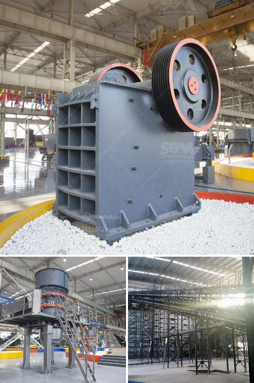

<h3>limestone ore concentration plant</h3>
Limestone, also known as calcium carbonate, is a sedimentary rock that is abundant in nature. It is primarily composed of the mineral calcite and finds extensive use in various industries due to its versatile properties. One of the key applications of limestone is in the production of cement, where it acts as a main ingredient.

To cater to the increasing demand for limestone, ore concentration plants have been set up in different parts of the world. These plants are responsible for extracting limestone from the ore and preparing it for various industrial processes. The process of extraction involves crushing the ore stone, grinding it to a fine powder, and then separating impurities using various techniques.

Once the ore has been extracted and impurities have been removed, the limestone undergoes a concentration process. This process primarily involves further grinding and filtering to achieve the desired particle size distribution and purity. The concentrated limestone is then used in various industries, such as cement, lime production, and glass manufacturing.

The limestone ore concentration plants employ advanced technology and equipment to ensure efficient and cost-effective processing. This includes various crushers, mills, and classifiers that aid in the size reduction and separation of limestone particles. Moreover, modern filtration systems are used to remove impurities and achieve the desired level of purity.

The importance of limestone ore concentration plants cannot be overstated for industries relying on limestone as a primary raw material. These plants ensure a consistent and high-quality supply of limestone, which is essential for the production of cement and other products. Furthermore, the concentration process allows for the extraction of limestone from ore sources that may have a lower natural purity, thereby expanding the availability of this valuable mineral.

In conclusion, limestone ore concentration plants play a vital role in meeting the increasing demand for limestone in various industries. These plants employ advanced technology to extract and concentrate limestone ore, ensuring a reliable supply of this essential mineral. With the continuous development of modern techniques, ore concentration plants are becoming more efficient and environmentally friendly, further enhancing their significance in the global limestone industry.
<h3>Contact us</h3><ul><li><strong>Whatsapp:&nbsp;<a href="https://wa.me/8613661969651">+8613661969651</a></strong></li><li><a href="https://swt.shibang-china.com/?git&amp;zhl&amp;limestone ore concentration plant"><strong>Online Service(chat now)</strong></a></li></ul><h3>Related</h3><ul><li><a href='crusher machine saudi arabia.md'>crusher machine saudi arabia</a></li><li><a href='cost of limestone powder crushing machine.md'>cost of limestone powder crushing machine</a></li><li><a href='coal crushing and washing plant for sale in south africa.md'>coal crushing and washing plant for sale in south africa</a></li><li><a href='stone crusher price in south africa.md'>stone crusher price in south africa</a></li><li><a href='grinding mills in china.md'>grinding mills in china</a></li></ul>