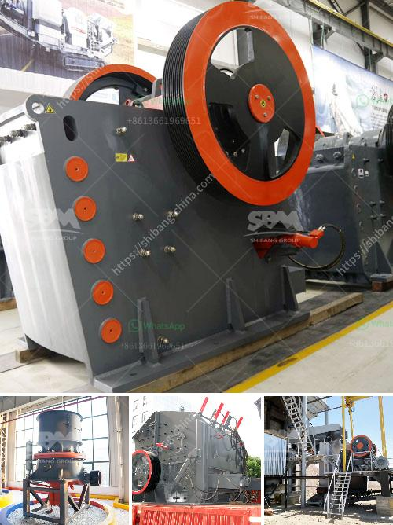

<h3>limestone processing equipment</h3>
Limestone is a sedimentary rock composed mostly of calcium carbonate (CaCO3). Limestone deposits are abundant, and as a result, it has been used throughout history in various applications, such as building materials, agriculture, and even as a raw material in chemical industries. However, before it can be used in these applications, limestone requires processing to achieve the desired characteristics and qualities.

The primary step in limestone processing is crushing. Limestone typically goes through a jaw crusher for the primary crushing stage. Then, it is processed into smaller pieces until it reaches the desired size. A cone crusher or impact crusher can be used in secondary crushing. After crushing, the limestone is sieved by a vibrating screen and then transported by a belt conveyor to the next processing stage.

Once the limestone is crushed and screened, it undergoes further processing to remove impurities and achieve the desired consistency. One common method is to use a rotary kiln to heat the limestone to a high temperature. This process, known as calcination, drives off carbon dioxide and produces quicklime (CaO). Quicklime can be used in various applications, including steel production, chemical processing, and water treatment.

To enhance the properties of limestone, further processing may be required. For example, if limestone is being used for agricultural purposes, it may need to be ground into a fine powder to ensure optimal soil pH levels. In this case, a limestone grinding mill is used to achieve the desired particle size.

There are several types of equipment used in limestone processing. Crushers, such as jaw crushers and impact crushers, are commonly used to crush limestone to the desired size. Vibrating screens can be used to separate particles according to their size and shape. Belt conveyors are used to transport the crushed limestone from one stage to another. Rotary kilns are essential for the calcination process, while grinding mills are employed for fine grinding.

In conclusion, limestone processing equipment plays a crucial role in the processing of limestone and its various applications. Properly processed limestone enhances the properties and improves the quality of the final product. With the right equipment, limestone can be processed efficiently and used in a wide range of industries, contributing to economic growth and development.
<h3>Contact us</h3><ul><li><strong>Whatsapp:&nbsp;<a href="https://wa.me/8613661969651">+8613661969651</a></strong></li><li><a href="https://swt.shibang-china.com/?git&amp;zhl&amp;limestone processing equipment"><strong>Online Service(chat now)</strong></a></li></ul><h3>Related</h3><ul><li><a href='crusher and screening plant price south africa.md'>crusher and screening plant price south africa</a></li><li><a href='stone crusher pfs price.md'>stone crusher pfs price</a></li><li><a href='roller coal mill.md'>roller coal mill</a></li><li><a href='stone crusher machine size 100 x 100 cm.md'>stone crusher machine size 100 x 100 cm</a></li><li><a href='wet process cement.md'>wet process cement</a></li></ul>