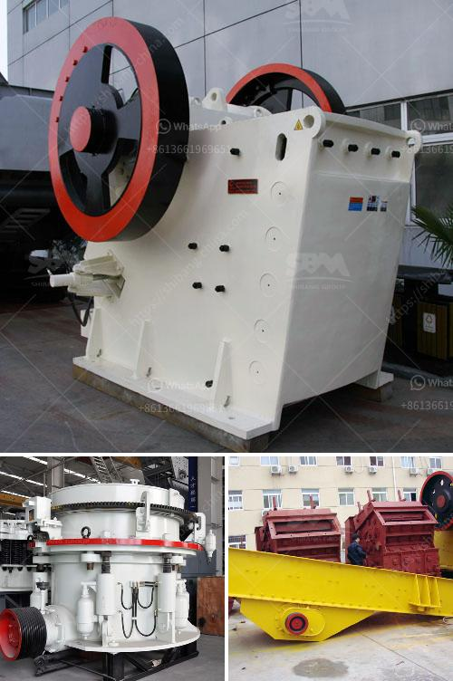

<h3>limestone processing plant philippines</h3>
Limestone is a common sedimentary rock found all over the world. Its versatility and durability make it an ideal material for various construction projects, including the production of cement, lime, and crushed aggregates. In the Philippines, limestone is widely used for road construction, building and infrastructure development, as well as industrial purposes.

For this reason, the establishment of limestone processing plants is a growing trend in the country. With the abundance of limestone deposits, mining and processing industries have become lucrative investments for both local and foreign investors. The Philippines' limestone resources are estimated to exceed 200 billion tons of reserves, making it an important component of the country's national economy.

Limestone processing plants are heavy-duty and self-contained limestone crushing plants and limestone grinding facilities designed for high production in quarry or concrete recycle operations. In the limestone crushing plant, jaw crushers or impact crushers are used to crush the raw limestone, while the grinding mills can grind the crushed limestone into fine powder suitable for various industries.

One essential aspect of the limestone processing plant is the feeder system. This system ensures a consistent flow of limestone to the primary crusher, which is vital for high-capacity crushing plants. The feeder system can be a belt conveyor, apron feeder, or vibrating feeder, depending on the specific requirements of the plant.

After the limestone is crushed, it is then transported to a limestone grinding mill for further processing. The grinding mill is capable of producing different sizes of limestone powder, commonly used in industries such as cement production, steel manufacturing, or as a soil amendment in agriculture.

The limestone processing plant in the Philippines also includes a stockpile or storage area for the limestone, known as a limestone stockpile, and a limestone storage silo, where the limestone is stored and mixed with other materials, such as clay or iron ore, to create the desired cement powder or aggregate blend.

In recent years, the demand for limestone processing plants in the Philippines has increased significantly due to the country's continuous infrastructure development and construction projects. The government's Build, Build, Build program, which aims to boost the country's infrastructure and construction industry, has led to an increased demand for limestone and other construction materials.

Moreover, the limestone processing plants in the Philippines also contribute to the country's economic growth through employment opportunities and increased revenue from exports. The processed limestone products, such as crushed aggregates and cement, are in high demand globally, particularly in neighboring countries in the Asia-Pacific region.

However, it is important to ensure that limestone processing plants in the Philippines comply with environmental regulations and sustainable mining practices. The extraction and processing of limestone can have adverse environmental impacts, including deforestation, land degradation, and water pollution. To mitigate these impacts, mining companies are encouraged to implement responsible extraction methods and rehabilitation measures to restore the mined areas.

In conclusion, limestone processing plants in the Philippines play a vital role in the country's construction and infrastructure development. The abundant limestone resources in the Philippines make it an attractive investment option for both local and international investors. However, it is crucial to ensure that limestone processing operations are conducted sustainably and in compliance with environmental regulations to minimize their impact on the environment.
<h3>Contact us</h3><ul><li><strong>Whatsapp:&nbsp;<a href="https://wa.me/8613661969651">+8613661969651</a></strong></li><li><a href="https://swt.shibang-china.com/?git&amp;zhl&amp;limestone processing plant philippines"><strong>Online Service(chat now)</strong></a></li></ul><h3>Related</h3><ul><li><a href='how to make limestone powder.md'>how to make limestone powder</a></li><li><a href='selling crusher grinding mill indonesia.md'>selling crusher grinding mill indonesia</a></li><li><a href='price of stone crushing machine.md'>price of stone crushing machine</a></li><li><a href='cobalt ore equipments nigeria.md'>cobalt ore equipments nigeria</a></li><li><a href='purchase of stone crusher.md'>purchase of stone crusher</a></li></ul>