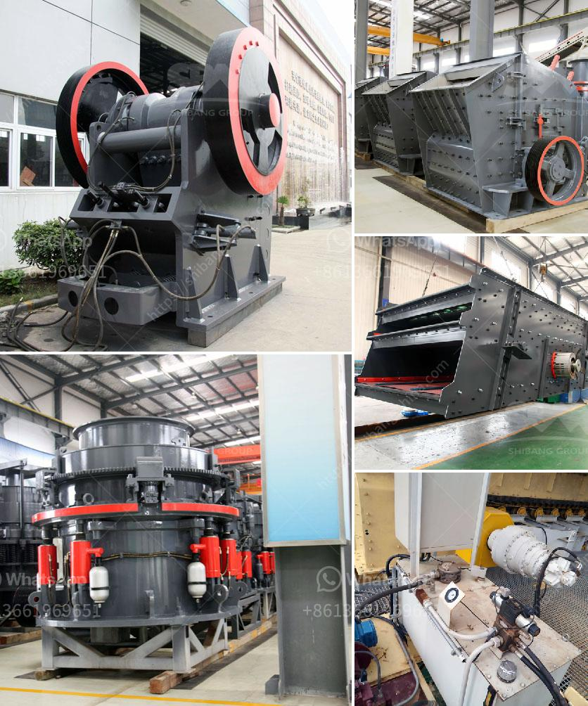

<h3>limestone stone making plant</h3>
Limestone, a sedimentary rock composed primarily of calcium carbonate, has been a fundamental building material for centuries. Its durability, versatility, and aesthetic appeal have made it a popular choice for construction projects worldwide. The increasing demand for limestone has led to the establishment of limestone stone making plants, facilitating the extraction, processing, and utilization of this invaluable resource.

A limestone stone making plant is a facility where limestone rocks are extracted from quarries and transformed into various products used in the construction industry. These plants consist of several essential processes, including blasting, crushing, grinding, and screening, all aimed at producing high-quality limestone products.

The first step in the limestone stone making process is blasting. This involves the use of explosives to break the limestone deposits into manageable chunks. The fragments are then transported to the crushing plant via heavy-duty trucks or conveyor belts. Prior to blasting, careful consideration is given to the environmental impact, ensuring that wildlife habitats and nearby communities are not negatively affected.

Once the limestone rocks have been blasted, they are transported to the primary crusher, where they are reduced in size. This crushing process not only ensures uniformity but also enhances the overall quality of the end products. The crushed limestone is then conveyed to grinding mills, where it is further refined and pulverized to achieve the desired consistency.

Next, the finely ground limestone is screened to separate different particle sizes. This screening process ensures the homogeneity of the final product and removes any impurities or oversized particles. The resulting limestone powder can then be integrated into cement, concrete, and asphalt or used as a filler in various manufacturing processes.

Limestone stone making plants play a crucial role in sustainable construction. Limestone is a non-renewable resource that must be carefully managed to ensure its availability for future generations. By establishing stone making plants, the extraction process can be regulated, minimizing environmental impacts such as deforestation, soil erosion, and water pollution.

Furthermore, limestone stone making plants contribute to the reduction of greenhouse gas emissions. By incorporating limestone powder into cement production, the amount of clinker needed is reduced. Clinker production is a major source of carbon dioxide emissions, so this substitution directly reduces the carbon footprint associated with construction activities.

Additionally, limestone's natural thermal properties make it an excellent insulator, allowing buildings constructed with limestone-derived materials to maintain a stable temperature. This reduces the energy consumed for heating and cooling, contributing to lower energy bills and a smaller carbon footprint.

In conclusion, limestone stone making plants are essential for meeting the construction industry's growing demand for this versatile and sustainable material. By carefully managing the extraction process, reducing environmental impacts, and integrating limestone into various construction materials, these plants play a vital role in sustainable development. In a world increasingly aware of the importance of environmentally conscious practices, limestone stone making plants provide a solution that combines durability, aesthetic appeal, and environmental responsibility.
<h3>Contact us</h3><ul><li><strong>Whatsapp:&nbsp;<a href="https://wa.me/8613661969651">+8613661969651</a></strong></li><li><a href="https://swt.shibang-china.com/?git&amp;zhl&amp;limestone stone making plant"><strong>Online Service(chat now)</strong></a></li></ul><h3>Related</h3><ul><li><a href='roller mill suppliers in mexico.md'>roller mill suppliers in mexico</a></li><li><a href='stone crusher plant south africa.md'>stone crusher plant south africa</a></li><li><a href='buy quarry machine from europe.md'>buy quarry machine from europe</a></li><li><a href='stone crusher machine in kenya.md'>stone crusher machine in kenya</a></li><li><a href='rock crushing machine speed limit.md'>rock crushing machine speed limit</a></li></ul>