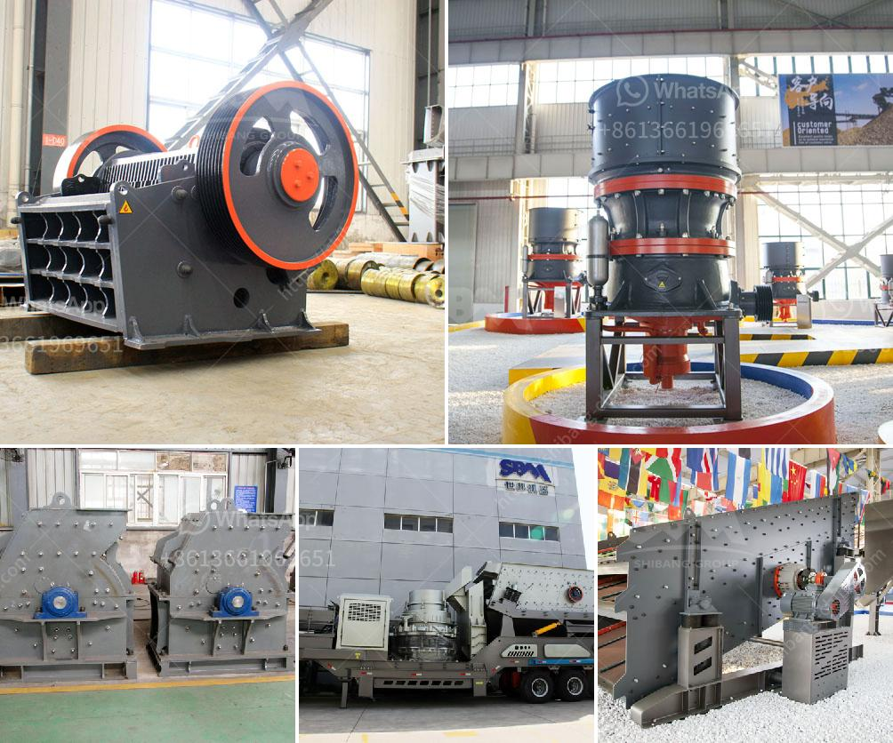

<h3>linear vibrating screener nigeria</h3>
Linear vibrating screeners are commonly used in the mining, pharmaceutical, food, and chemical industries to separate materials based on their particle size. Nigeria, a country known for its vast mineral resources, has a diverse range of industries that greatly benefit from the use of these screening machines.

Linear vibrating screeners are designed with a rectangular screening surface and suitable mesh openings to allow the passage of desired materials. The screening process begins with the feed material being evenly distributed onto the mesh surface. As the machine vibrates in a linear motion, the particles are separated based on their size and shape. This results in the finer particles passing through the mesh, while the larger ones are retained on the surface.

One of the main advantages of linear vibrating screeners in Nigeria is their ability to handle a large capacity of materials. This is crucial in industries such as mining, where large quantities of minerals need to be processed. The high-capacity nature of these screeners allows for efficient and continuous production, reducing downtime and increasing overall productivity.

Linear vibrating screeners in Nigeria also offer excellent screening efficiency. The linear motion of the machine ensures that the particles have sufficient time to pass through the mesh openings, resulting in a more accurate separation. This is particularly important in industries such as pharmaceuticals and food, where product quality and purity are critical. By effectively removing oversized particles, contaminants, and impurities, linear vibrating screeners contribute to the production of high-quality end products.

In addition to their efficient and accurate screening capabilities, linear vibrating screeners in Nigeria are also highly customizable. Different mesh sizes can be used to achieve the desired separation and particle size distribution. This flexibility allows industries to adapt the screening process to meet specific requirements and optimize their production processes.

Furthermore, linear vibrating screeners are known for their low maintenance requirements and operational costs. The simple design of these machines, combined with their sturdy construction, ensures prolonged and trouble-free operation. Additionally, the absence of mechanical parts such as belts and pulleys reduces the risk of breakdowns, resulting in lower maintenance and repair costs.

The use of linear vibrating screeners in Nigeria has revolutionized various industries by improving production efficiency, product quality, and reducing costs. These machines have become an integral part of mineral processing, pharmaceutical manufacturing, food processing, and chemical production. As the demand for high-quality products continues to rise, linear vibrating screeners offer an efficient and reliable screening solution.

In conclusion, linear vibrating screeners have proven to be invaluable in Nigeria's industrial sectors. Their ability to handle high capacity, provide accurate separation, and offer customization options, make them an ideal choice for a diverse range of applications. As Nigeria's industries continue to grow and evolve, the use of linear vibrating screeners will remain crucial in improving productivity and ensuring the production of high-quality goods.
<h3>Contact us</h3><ul><li><strong>Whatsapp:&nbsp;<a href="https://wa.me/8613661969651">+8613661969651</a></strong></li><li><a href="https://swt.shibang-china.com/?git&amp;zhl&amp;linear vibrating screener nigeria"><strong>Online Service(chat now)</strong></a></li></ul><h3>Related</h3><ul><li><a href='quotation for stone crusher.md'>quotation for stone crusher</a></li><li><a href='price of a stone crusher.md'>price of a stone crusher</a></li><li><a href='quarry equipment china.md'>quarry equipment china</a></li><li><a href='industrial mills for coal.md'>industrial mills for coal</a></li><li><a href='price of portable stonecrusher.md'>price of portable stonecrusher</a></li></ul>