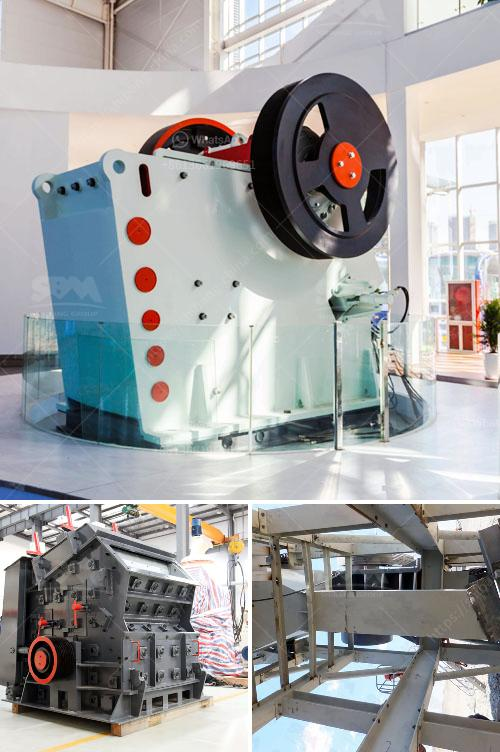

<h3>lippman jaw crusher for sale</h3>
Lippman jaw crusher is a popular crushing equipment and mostly used for primary crushing in various industries. Its quality is ensured by a stringent quality control process, which ensures that each equipment complies with specific performance standards to meet customer requirements. The jaw crusher offers high capacity, low maintenance, excellent performance, and easy operation.

One of the key features of the Lippman jaw crusher is its ability to process hard and abrasive materials. The jaw crusher consists of a heavy-duty, sturdy frame and is equipped with two robust oversized bearings, which are designed to withstand even the toughest applications. This allows the crusher to handle a wide range of materials, including granite, basalt, limestone, and even recycled concrete.

Another notable feature of the Lippman jaw crusher is its hydraulic toggle system. This system allows the crusher to easily adjust the closed side setting (CSS) and relieve any uncrushable material, minimizing downtime and maximizing productivity. The hydraulic toggle system also prevents any damage to the crusher from overloading, ensuring its longevity.

In terms of performance, the Lippman jaw crusher delivers impressive results. The crusher is powered by a high efficiency 300-400 HP motor, which ensures the highest energy efficiency ratings. It features a deep crushing chamber with large gape and steep crushing angle, which delivers consistent product size and high reduction ratio. This results in a higher throughput capacity, making it ideal for large quarrying or mining operations.

Maintenance of the Lippman jaw crusher is simple and hassle-free. The crusher is equipped with a hydraulically assisted jaw adjustment system, which makes it quick and easy to change the CSS. The crusher is also designed with replaceable wear parts, making it easy to maintain and extend its service life. Additionally, the crusher is equipped with a dual wedge system, which allows easy adjustment of the closed side setting.

When it comes to safety, the Lippman jaw crusher prioritizes the protection of its users. It is designed with a large feed opening, which reduces the risk of material bridging and ensures a smooth flow of material into the crushing chamber. The jaw crusher is also equipped with a hydraulic release system, which provides overload protection in case of uncrushable material or tramp iron entering the crushing chamber.

In conclusion, the Lippman jaw crusher offers excellent performance, high capacity, and ease of operation. Its robust construction, hydraulic toggle system, and efficient motor make it a reliable and efficient crushing equipment. Whether it is used in mining, construction, or recycling applications, the Lippman jaw crusher will undoubtedly deliver superior results. With its quality craftsmanship and proven track record, the Lippman jaw crusher is a solid investment for any industry.
<h3>Contact us</h3><ul><li><strong>Whatsapp:&nbsp;<a href="https://wa.me/8613661969651">+8613661969651</a></strong></li><li><a href="https://swt.shibang-china.com/?git&amp;zhl&amp;lippman jaw crusher for sale"><strong>Online Service(chat now)</strong></a></li></ul><h3>Related</h3><ul><li><a href='mobile crusher wanted for rent in johor.md'>mobile crusher wanted for rent in johor</a></li><li><a href='malaysia conveyor belts price.md'>malaysia conveyor belts price</a></li><li><a href='grinding mill machine cost price south africa.md'>grinding mill machine cost price south africa</a></li><li><a href='mobile and modular coal washing plants.md'>mobile and modular coal washing plants</a></li><li><a href='ball mills vietnam.md'>ball mills vietnam</a></li></ul>