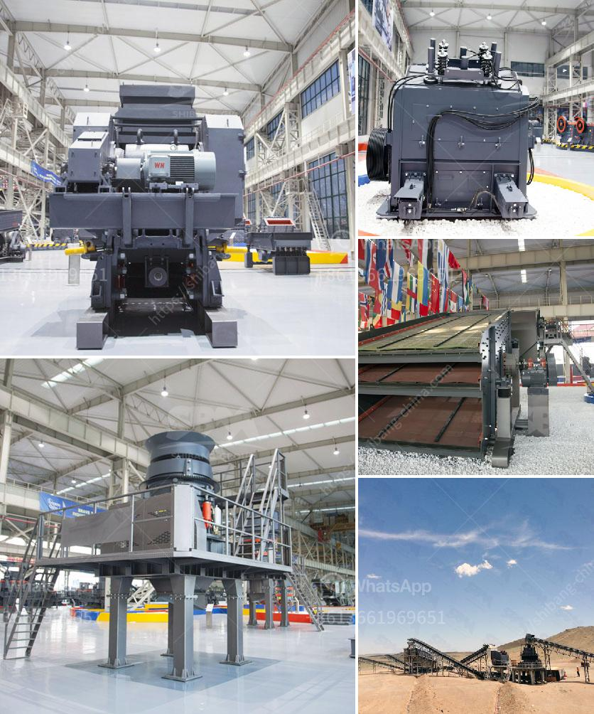

<h3>list of gold refineries companies in uae</h3>
The United Arab Emirates (UAE) is undoubtedly a global hub for trade and commerce. With its strategic location between Europe, Asia, and Africa, the country has attracted numerous international investors and businesses. Among the thriving industries in the UAE is the gold refining sector, which plays a vital role in the region's economy.

Gold refining involves the process of purifying and transforming raw gold into its final form, such as bars or ingots. This crucial step ensures that the gold meets international standards and can be traded globally. In the UAE, several refineries specialize in this process, catering to both domestic and international demand.

One prominent player in the UAE's gold refining industry is Kaloti Precious Metals. Established in 1988, Kaloti has gained a strong reputation for its commitment to transparency, ethics, and quality. It operates one of the world's largest gold and precious metals refineries, located in the heart of Dubai. Kaloti offers a wide range of refining services, including gold, silver, platinum, and palladium, serving customers from various sectors, including jewelry manufacturers, banks, and government entities.

Besides Kaloti, Emirates Gold is another major player in the UAE gold refining scene. Founded in 1992, Emirates Gold has since established itself as a trusted name in the industry, with a focus on innovation and sustainable practices. The refinery is ISO 9001:2015 certified, ensuring the highest quality standards in its operations. Emirates Gold serves both the local and international markets, offering refining, assaying, and minting services.

Other notable gold refineries in the UAE include Al Etihad Gold and Gulf Gold Refinery. Al Etihad Gold is a Dubai-based company that provides a wide range of gold-related services, such as refining, smelting, and assaying. The company is accredited by the Dubai Gold and Commodities Exchange (DGCX) and the Dubai Multi Commodities Centre (DMCC). Gulf Gold Refinery, on the other hand, operates in Sharjah and trades gold and other precious metals, in addition to offering refining services.

It is important to note that all gold refineries operating in the UAE must comply with the rules and regulations set by the government to ensure ethical practices. The government's aim is to maintain the country's reputation as a reliable and transparent gold trading hub. To this end, the Dubai Multi Commodities Centre (DMCC) plays a crucial role. The DMCC is the regulatory authority that oversees the gold refining industry in Dubai, ensuring compliance with anti-money laundering and anti-terrorism financing laws.

In conclusion, the UAE is home to several reputable gold refineries, contributing significantly to the country's economy. Companies like Kaloti Precious Metals, Emirates Gold, Al Etihad Gold, and Gulf Gold Refinery are key players in this sector. Their commitment to transparent and ethical practices, along with compliance with local regulations, ensures the UAE's position as a major global player in the gold refining industry. As the demand for gold continues to grow, these refineries will play a crucial role in shaping the future of the global gold market.
<h3>Contact us</h3><ul><li><strong>Whatsapp:&nbsp;<a href="https://wa.me/8613661969651">+8613661969651</a></strong></li><li><a href="https://swt.shibang-china.com/?git&amp;zhl&amp;list of gold refineries companies in uae"><strong>Online Service(chat now)</strong></a></li></ul><h3>Related</h3><ul><li><a href='types of stone crusher machine list.md'>types of stone crusher machine list</a></li><li><a href='process of making talcum powder.md'>process of making talcum powder</a></li><li><a href='jaw crusher for sale in nigeria.md'>jaw crusher for sale in nigeria</a></li><li><a href='mobile gold processing plant south africa.md'>mobile gold processing plant south africa</a></li><li><a href='crusher plant equipment supplier in saudi arabia.md'>crusher plant equipment supplier in saudi arabia</a></li></ul>