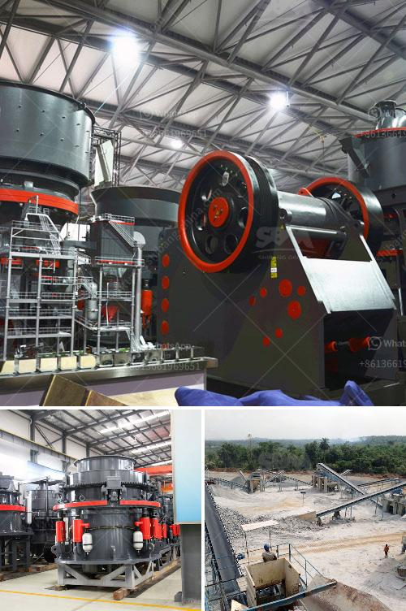

<h3>list of mini cement plants in gujarat</h3>
Gujarat, a leading industrial state in western India, is known for its vibrant business environment and a well-developed infrastructure. The state is also home to a number of mini cement plants that contribute to its overall economic growth. These plants play a crucial role in meeting the demand for cement in the region while generating employment opportunities.

1. Sanghi Industries Limited: Located in Kutch, Sanghi Industries is one of the largest cement producers in Gujarat. It has two mini cement plants with a capacity of 4.5 million tons per annum. The company is known for its innovative and sustainable practices, and its cement has been used in various prestigious infrastructure projects.

2. Gujarat Sidhee Cement Limited: Established in the year 1973, Gujarat Sidhee Cement Limited operates a mini cement plant in Sidheegram, Gujarat. The plant has a capacity of 1.2 million tons per annum and is known for its high-quality cement and adherence to international standards.

3. Nuvoco Vistas Corp. Ltd.: Formerly known as Lafarge India Pvt. Ltd., Nuvoco Vistas Corp. Ltd. operates a mini cement plant in Kovaya, Gujarat, with a capacity of 3.1 million tons per annum. The company focuses on sustainable construction and has been recognized for its efforts in environmental conservation.

4. Ambuja Cements Ltd.: Ambuja Cements is a renowned cement manufacturer with a mini plant in Maratha, Gujarat, with a capacity of 1.79 million tons per annum. The company has consistently been a top performer in terms of cement production and is known for its strong distribution network.

5. JK Cement Ltd.: JK Cement operates a mini cement plant in Balasinor, Gujarat. With a capacity of 0.5 million tons per annum, the plant caters to the growing demand for cement in the region. The company has a strong emphasis on research and development, ensuring technologically advanced and eco-friendly cement production.

These are just a few examples of the mini cement plants present in Gujarat. The state's favorable business environment, availability of raw materials, and skilled labor have contributed to the establishment and growth of these plants. They not only meet the demand for cement but also contribute to the overall economic development of the state.

The mini cement plants in Gujarat provide employment opportunities to the local population, boosting the socio-economic conditions of the region. These plants also contribute to infrastructure development by supplying cement for various construction projects. Additionally, their adoption of sustainable practices ensures minimal environmental impact.

Overall, the presence of mini cement plants in Gujarat reflects the state's commitment to industrial growth and sustainability. With their high-quality products and focus on innovation, these plants continue to play a significant role in meeting the demand for cement in the region.
<h3>Contact us</h3><ul><li><strong>Whatsapp:&nbsp;<a href="https://wa.me/8613661969651">+8613661969651</a></strong></li><li><a href="https://swt.shibang-china.com/?git&amp;zhl&amp;list of mini cement plants in gujarat"><strong>Online Service(chat now)</strong></a></li></ul><h3>Related</h3><ul><li><a href='grinding mill tecator cyclotec.md'>grinding mill tecator cyclotec</a></li><li><a href='hammer mill design plans pdf mtm crusher.md'>hammer mill design plans pdf mtm crusher</a></li><li><a href='calcite grinding process.md'>calcite grinding process</a></li><li><a href='rubber belt conveyor for sale.md'>rubber belt conveyor for sale</a></li><li><a href='how to start a coal mine.md'>how to start a coal mine</a></li></ul>